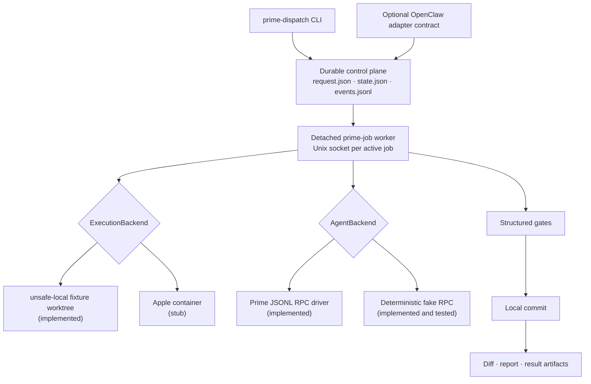
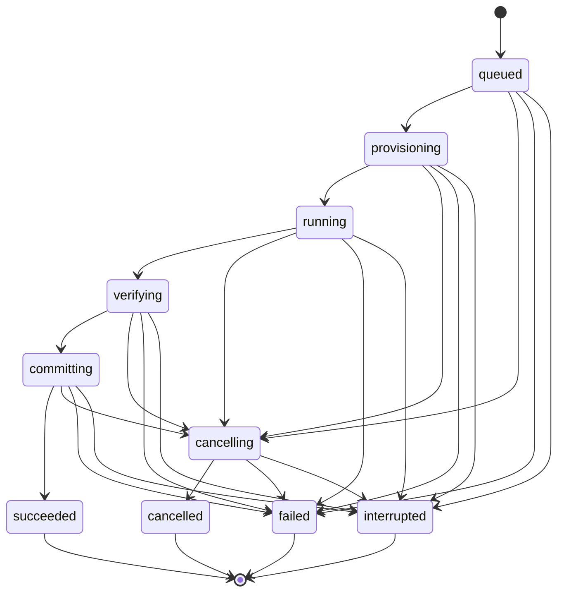

# Prime Dispatch Prototype

A bounded spike for this question:

> Can a standalone TypeScript control plane launch one root-only Prime agent as a detached Git job, reconnect from later CLI invocations, enforce basic policy, and preserve an auditable result?

This is not production-ready. The default execution backend is intentionally named `unsafe-local` and accepts fixture repositories only.

## Verdict: Beta Milestone 1 COMPLETE for disposable fixtures

The vertical slice now validates detached per-job workers, reconnectable Unix-socket control, JSON/Zod state, Git worktrees, structured verification gates, cancellation, local commits, result artifacts, path policy, a real Prime JSONL RPC subprocess, and Codex-subscription inference through a scoped host broker.

Ordinary tests remain deterministic and use fake Prime/local upstreams. The opt-in real acceptance is fixture-only. This beta does not provide filesystem/network containment, automatic worker-death resume, Apple containers, or an installed OpenClaw plugin.

Recommendation: keep live use limited to disposable fixtures until an operator explicitly selects a trusted repository. The next implementation step is the thin OpenClaw adapter and Discord confirmation/status UX. Containment remains deferred.

See the [Beta Milestone 1 report](docs/beta-milestone-1.md) for TDD evidence, live acceptance evidence, and remaining risks.

The tracked [Codex subscription spike](spikes/001-codex-subscription/README.md) subsequently validated a real Prime `0.7.2` fixture run through an OpenClaw-authenticated, scoped loopback broker using `gpt-5.6-sol` with high reasoning. That clears the subscription-auth feasibility gate, but it does not make this overall control-plane prototype production-ready or add containment.

## Scope and architecture



The CLI command names are short (`start`, `status`, `steer`, `cancel`, `result`), while the API schemas and worker IPC retain the explicit operations `prime_start`, `prime_status`, `prime_steer`, `prime_cancel`, and `prime_result`.

Each job has this layout:

```text
<state-root>/jobs/<job-id>/
  request.json              immutable; created with O_EXCL
  state.json                authoritative snapshot, schemaVersion + revision
  events.jsonl              append-only audit/progress journal
  artifacts/
    result.json
    report.md
    final.diff
    checks/
    logs/worker.log
    prime-agent/             dedicated Prime HOME/config/session directory
```

Snapshots are written with temporary-file creation, file `fsync`, rename, and parent-directory `fsync`. Per-job `mkdir` locks serialize writers across processes. The event reader tolerates only a truncated final JSONL record; corruption in an earlier complete record fails closed.

The state machine is:



Same-state transitions are idempotent. Other transitions are validated explicitly.

## Install and verify

Requires Node.js 22 or newer and Git.

```bash
cd /var/lib/evie-agent/src/prime-dispatch-prototype
pnpm install
pnpm run format
pnpm run typecheck
pnpm test
```

The real Codex-subscription fixture is opt-in:

```bash
pnpm run build
pnpm run test:live
```

The test suite has deterministic unit/integration layers plus an opt-in real acceptance. Focused tests cover schema defaults and bounds, broker policy, release and executable verification, host configuration, complete confirmation binding, Prime turn limits, the state-transition matrix, stale-lease recovery, store revisions and locking, private IPC, Git transport blocking, artifact path safety, full-lifecycle command limits, and adapter authorization. Deterministic integration tests use only temporary fixture repositories and fake Prime; the opt-in test uses real Prime and Codex subscription auth against a disposable fixture.

- happy path, gate, worktree, commit, report and result;
- `RLM_MAX_DEPTH=0` and dedicated `PRIME_AGENT_CODING_AGENT_DIR` observation;
- a new CLI process steering and cancelling a surviving worker;
- cancellation of an active verification gate and full-job wall-clock enforcement;
- final partial JSONL handling and middle-record corruption;
- stale global-lease and dead-launch reconciliation;
- remote transport rejection even when the Git wrapper is bypassed;
- repo-root and symlink-escape rejection;
- the fixture-only execution guard;
- trusted channel plus sender authorization in the OpenClaw adapter contract.

## Run a fixture job

Create a disposable repository:

```bash
SPIKE_FIXTURE="$(mktemp -d /tmp/prime-dispatch-fixture.XXXXXX)"
git -C "$SPIKE_FIXTURE" init -b main
printf 'fixture\n' > "$SPIKE_FIXTURE/README.md"
git -C "$SPIKE_FIXTURE" add README.md
git -C "$SPIKE_FIXTURE" -c user.name=Fixture -c user.email=fixture@local.invalid commit -m fixture
```

Build and start a detached fake job:

```bash
cd /var/lib/evie-agent/src/prime-dispatch-prototype
pnpm run build
node dist/cli.js start \
  --state-root /tmp/prime-dispatch-state \
  --task "write the deterministic fixture output" \
  --repo "$SPIKE_FIXTURE" \
  --repo-root /tmp \
  --channel local-test \
  --sender local-test \
  --fixture \
  --yes \
  --gate '{"name":"output","command":"test","args":["-f","prototype-output.txt"],"timeoutMs":2000}'
```

Use the returned job ID:

```bash
node dist/cli.js status --state-root /tmp/prime-dispatch-state --job-id JOB_ID
node dist/cli.js steer --state-root /tmp/prime-dispatch-state --job-id JOB_ID --message "stay bounded"
node dist/cli.js cancel --state-root /tmp/prime-dispatch-state --job-id JOB_ID
node dist/cli.js result --state-root /tmp/prime-dispatch-state --job-id JOB_ID
```

`steer` and `cancel` apply only while the worker socket exists. `status` reads the durable snapshot, and `result` reads the durable terminal artifact.

## Prime compatibility

The compatibility target is Prime Agent **0.7.2**, commit **`97b994c3d7c45ca1ae635190e91e9e58ddf2577c`**.

Reference protocol: <https://github.com/PrimeIntellect-ai/prime-agent/blob/97b994c3d7c45ca1ae635190e91e9e58ddf2577c/packages/coding-agent/docs/rpc.md>

The driver uses strict LF-delimited JSONL and the official command shapes:

- `{"type":"prompt","message":"..."}`
- `{"type":"steer","message":"..."}`
- `{"type":"abort"}`
- terminal `agent_end` events

For real Prime, provide `--host-config` containing the trusted release artifact, executable, repository roots, and gates. Callers cannot choose the model or reasoning level. The worker verifies the pinned tarball and executable checksums plus the reported version, launches JSONL RPC with `gpt-5.6-sol`/high, uses a job-private HOME/config/session directory plus a short private macOS TMPDIR, exposes only IPython, and sets `RLM_MAX_DEPTH=0`.

## Security and threat model

The code assumes Discord text, model output, repository contents and Git refs are untrusted. It therefore:

- resolves repo paths and allowlist roots through `realpath`;
- rejects symlink escapes and requires the canonical Git worktree root;
- resolves the selected base to an immutable commit SHA before dispatch;
- never fetches, pushes, opens PRs or imports dirty source-checkout changes;
- disables Git transports in the inherited process environment, even if the wrapper is bypassed;
- creates a dedicated branch and worktree for each job;
- represents gates as an executable plus argv, never an interpolated shell string;
- limits gate time and captured output;
- gives the Prime process a minimal environment and dedicated HOME/config path;
- requires both trusted channel and sender authorization for mutating OpenClaw tools;
- preserves commits, diffs, logs and reports instead of deleting them automatically.

The `unsafe-local` backend is **not a sandbox**. A model-driven process can read any host file available to its OS user and can access the network. A minimal environment does not change filesystem permissions. Therefore live repositories are rejected unless `--unsafe-allow-live-repo` is explicitly supplied, and this spike intentionally performs no real-repository smoke test.

The OpenClaw adapter is a compile-time contract, not an installed plugin. It consumes trusted `channelId`, `requesterSenderId`, owner status, repository roots, fixture policy, and agent selection from the host integration; those values must never come from model tool arguments. Model-supplied attempts to override roots, unsafe-local permission, agent executable, or authorization are stripped by the adapter schema and replaced with policy-owned values.

The production inference broker resolves Codex subscription OAuth through OpenClaw's public provider-auth runtime, fixes the upstream/model/reasoning server-side, issues revocable per-job tokens, enforces expiry/request/concurrency/observable-token limits, and never exposes or logs provider credentials or bodies. Do **not** point Prime at OpenClaw's existing `/v1/chat/completions`; that endpoint runs another agent loop and uses broad Gateway authority.

## Known limitations

- A surviving job worker can be reached by later CLI/adapter processes. If the job worker itself dies, automatic reconciliation and transcript/worktree resume are not implemented; the last durable state and artifacts remain for inspection.
- Worker PID identity is not protected against PID reuse. Locks require both age and a missing PID before reclamation, but production needs OS process-start identity or leases.
- The dispatcher is not a resident scheduler. A failed worker is reconciled when status is next queried, not proactively while no client is running.
- Cancellation escalates from RPC abort to process-group `SIGTERM` and `SIGKILL`, but crash injection around every transition has not been exhaustively tested.
- Token usage is observable only after an upstream response, so a single response can overshoot the remaining token budget. Wall-clock, turn, gate, output, concurrency, and cumulative observable-token limits are enforced.
- Event sequencing scans the journal and is suitable only for a small spike ledger.
- Concurrent writers in separate worktrees of the same repository are not serialized; repository-local build services can still conflict.
- Worktrees and branches are intentionally preserved. There is no cleanup command yet.
- The Apple container backend remains a stub; the scoped inference broker is implemented.
- Editable Discord status cards are deferred behind `NotificationSink`; only console/no-op sinks exist.
- Ordinary tests use no real Prime binary, provider credential, or job network call. The opt-in acceptance test exercises the production real-Prime/broker path only against a disposable fixture; it makes no EVP change or real-repository write.

## Production exit criteria

Before adopting this design, add stable worker supervision/recovery, PID-start-identity leases, authoritative cost accounting, bounded artifact storage and cleanup, plugin packaging, and crash/fault tests across every state transition. Container confinement remains a later hardening milestone. After the integration passes the disposable fixture again, smoke-test only a deliberately selected trusted local repository.

## Spike verdict template

```text
Verdict: VALIDATED | PARTIAL | INVALIDATED
Question:
Evidence (exact command/output/measurement):
What worked:
What failed or surprised us:
Recommendation:
```
