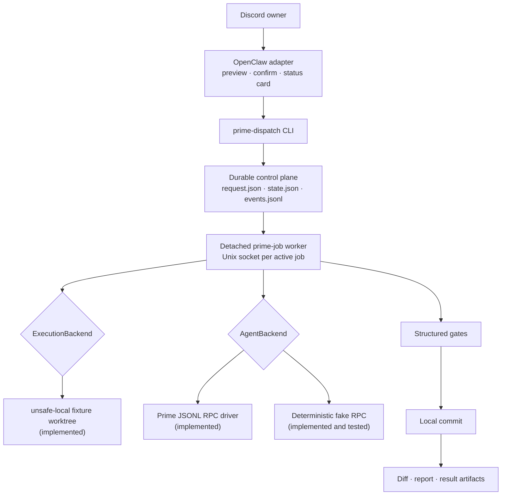
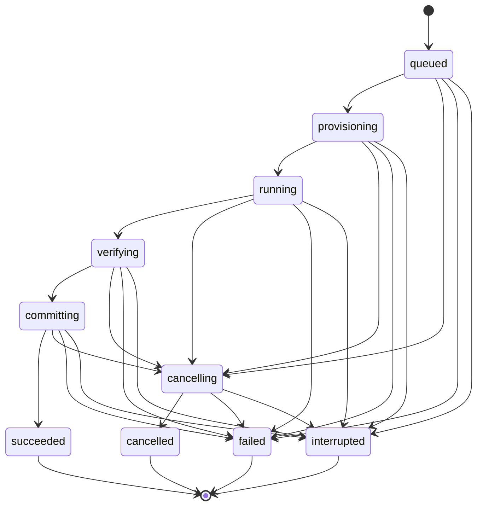

# Prime Dispatch Prototype

A bounded spike for this question:

> Can a standalone TypeScript control plane launch Prime with built-in child delegation disabled as a detached Git job, reconnect from later CLI invocations, enforce basic policy, and preserve an auditable result?

This is not production-ready. The default execution backend is intentionally named `unsafe-local` and accepts fixture repositories only.

## Current status

- **Subscription feasibility gate:** [`spikes/001-codex-subscription`](spikes/001-codex-subscription/README.md) is **VALIDATED**. Real Prime Agent `0.7.2` completed a streamed tool-call fixture run with `gpt-5.6-sol` and high reasoning through OpenClaw-held Codex subscription authentication. Prime received only a scoped, revocable token.
- **Beta Milestone 1:** **COMPLETE for the disposable-fixture CLI scope, with reviewed limitations.** It productionizes the broker seam, checks the pinned Prime release and entrypoint, adds immutable confirmation and trusted host policy, enforces one global job and finite budgets, and validates real Prime completion and cancellation. Complete dependency-tree integrity remains a follow-up.
- **Worker reconnection:** detached workers now persist PID plus OS process-start identity, a random nonce, private socket path, and protocol version. CLI startup scans nonterminal jobs and accepts a worker only after both process identity and a nonce-bound socket handshake match.
- **Beta Milestone 2:** **IMPLEMENTED for the operational Discord fixture path.** The package in [`openclaw-plugin`](openclaw-plugin/README.md) exposes five owner-only typed tools, hash-bound one-time confirmation, editable status-card delivery, terminal notification catch-up, and the standalone CLI/control boundary. See the [Beta Milestone 2 report](docs/beta-milestone-2.md).
- **OpenClaw deployment:** [`prime-dispatch-openclaw`](docs/openclaw-host-lifecycle.md) prepares versioned host-local releases, migrates durable state, validates the exact OpenClaw config delta, and provides idempotent upgrade, audit, rollback, and state-preserving uninstall operations.
- **Containment:** containers are deferred. Current-user execution is explicitly unsafe-local and must be limited to trusted repositories.
- **Control-plane direction:** the current JSON/Zod store remains the Milestone 1 implementation. [ADR-0013](docs/adrs/0013-sqlite-authority-with-json-artifacts.md) supersedes it for future crash-consistent work: SQLite becomes authoritative while JSON, reports, diffs, and logs remain inspectable artifacts.

The project uses **pnpm exclusively**. Do not create or commit `package-lock.json` or use npm for project lifecycle commands.

## Verdict: Beta Milestone 1 COMPLETE for disposable fixtures

The vertical slice now validates detached per-job workers, reconnectable Unix-socket control, JSON/Zod state, Git worktrees, structured verification gates, cancellation, local commits, result artifacts, path policy, a real Prime JSONL RPC subprocess, and Codex-subscription inference through a scoped host broker.

Ordinary tests remain deterministic and use fake Prime/local upstreams. The opt-in real acceptance is fixture-only. This beta does not provide filesystem/network containment, automatic worker-death resume, or Apple containers. OpenClaw installation is now a separate, explicit operator lifecycle.

Recommendation: keep live use limited to disposable fixtures until an operator explicitly selects a trusted repository. The next implementation step is the self-contained pinned runtime required before selected real-repository rollout. Containment remains deferred.

See the [Beta Milestone 1 report](docs/beta-milestone-1.md) for TDD evidence, live acceptance evidence, and remaining risks.

## Scope and architecture



The CLI command names are short (`start`, `status`, `steer`, `cancel`, `result`), while the OpenClaw adapter and API schemas expose the explicit operations `prime_start`, `prime_status`, `prime_steer`, `prime_cancel`, and `prime_result`.

Every CLI invocation scans nonterminal jobs before handling its requested
operation. A matching live worker is reconnected without restarting Prime; a
dead process, reused PID, wrong job, wrong nonce, or incompatible protocol is
rejected and conservatively reconciled to `interrupted`. A worker whose OS
identity still matches but whose socket is temporarily unreachable keeps its
lease and is reported as unverified rather than being replaced. Lifecycle
events expose deterministic delivery keys and durable per-consumer cursors so
the later OpenClaw adapter can catch up missed milestone and terminal
notifications idempotently.

Each job has this layout:

```text
<state-root>/jobs/<job-id>/
  request.json              immutable; created with O_EXCL
  state.json                authoritative snapshot, schemaVersion + revision
  events.jsonl              append-only audit/progress journal
  artifacts/
    result.json
    report.md
    final.diff
    checks/
    logs/worker.log
    prime-agent/             dedicated Prime HOME/config/session directory
```

Snapshots are written with temporary-file creation, file `fsync`, rename, and parent-directory `fsync`. Per-job `mkdir` locks serialize writers across processes, bind ownership to PID plus process-start identity, and serialize stale-lock reclamation before quarantining the abandoned directory. The event reader tolerates only a truncated final JSONL record; corruption in an earlier complete record fails closed.

The state machine is:



Same-state transitions are idempotent. Other transitions are validated explicitly.

## Install and verify

Requires Node.js 22 or newer and Git. CI uses Node.js 24 and the
repository-pinned pnpm version.

```bash
cd /var/lib/evie-agent/src/prime-dispatch-prototype
pnpm install --frozen-lockfile
pnpm run format
pnpm run typecheck
pnpm test
pnpm audit --audit-level=high
```

Pull requests and pushes to `main` run the same deterministic checks in
GitHub Actions. If branch protection is enabled, require the `CI / quality`
check. The credentialed `test:live` acceptance remains opt-in and does not run
in ordinary CI.

The real Codex-subscription fixture is opt-in:

```bash
pnpm run build
pnpm run test:live
```

The test suite has deterministic unit/integration layers plus an opt-in real acceptance. Focused tests cover schema defaults and bounds, broker policy, release and executable verification, host configuration, complete confirmation binding, Prime turn limits, the state-transition matrix, stale-lease recovery, store revisions and locking, private IPC, Git transport deterrence, artifact path safety, and full-lifecycle command limits. Deterministic integration tests use temporary fixture repositories and fake Prime; the opt-in test uses real Prime and Codex subscription auth against a disposable fixture.

- happy path, gate, worktree, commit, report and result;
- `RLM_MAX_DEPTH=0` and dedicated `PRIME_AGENT_CODING_AGENT_DIR` observation;
- a new CLI process steering and cancelling a surviving worker;
- cancellation of an active verification gate and full-job wall-clock enforcement;
- final partial JSONL handling and middle-record corruption;
- stale global-lease and dead-launch reconciliation;
- defense-in-depth Git transport deterrence through a wrapper and scrubbed configuration;
- repo-root and symlink-escape rejection;
- the fixture-only execution guard;

## Run a fixture job

Create a disposable repository:

```bash
SPIKE_FIXTURE="$(mktemp -d /tmp/prime-dispatch-fixture.XXXXXX)"
git -C "$SPIKE_FIXTURE" init -b main
printf 'fixture\n' > "$SPIKE_FIXTURE/README.md"
git -C "$SPIKE_FIXTURE" add README.md
git -C "$SPIKE_FIXTURE" -c user.name=Fixture -c user.email=fixture@local.invalid commit -m fixture
```

Build and start a detached fake job:

```bash
cd /var/lib/evie-agent/src/prime-dispatch-prototype
pnpm run build
node dist/cli.js start \
  --state-root /tmp/prime-dispatch-state \
  --task "write the deterministic fixture output" \
  --repo "$SPIKE_FIXTURE" \
  --repo-root /tmp \
  --channel local-test \
  --sender local-test \
  --fixture \
  --yes \
  --gate '{"name":"output","command":"test","args":["-f","prototype-output.txt"],"timeoutMs":2000}'
```

Use the returned job ID:

```bash
node dist/cli.js status --state-root /tmp/prime-dispatch-state --job-id JOB_ID
node dist/cli.js steer --state-root /tmp/prime-dispatch-state --job-id JOB_ID --message "stay bounded"
node dist/cli.js cancel --state-root /tmp/prime-dispatch-state --job-id JOB_ID
node dist/cli.js result --state-root /tmp/prime-dispatch-state --job-id JOB_ID
```

`steer` and `cancel` apply only while the worker socket exists. `status` reads the durable snapshot and advances the adapter's idempotent notification cursor, and `result` reads the durable terminal artifact.

## Prime compatibility

The compatibility target is Prime Agent **0.7.2**, commit **`97b994c3d7c45ca1ae635190e91e9e58ddf2577c`**.

Reference protocol: <https://github.com/PrimeIntellect-ai/prime-agent/blob/97b994c3d7c45ca1ae635190e91e9e58ddf2577c/packages/coding-agent/docs/rpc.md>

The driver uses strict LF-delimited JSONL and the official command shapes:

- `{"type":"prompt","message":"..."}`
- `{"type":"steer","message":"..."}`
- `{"type":"abort"}`
- terminal `agent_end` events

For real Prime, provide `--host-config` containing the trusted release artifact, executable, repository roots, per-repository fixture classification, and gates. Repository entries default to non-fixtures; a caller-supplied `--fixture` flag cannot relabel a host-configured repository. Callers cannot choose the model or reasoning level. Real Prime also rejects `--yes`: review the first invocation's resolved summary and rerun with its `--confirm-hash`.

The worker verifies the pinned tarball and executable checksums plus the reported version, launches JSONL RPC with `gpt-5.6-sol`/high, uses a job-private HOME/config/session directory plus a short private macOS TMPDIR, exposes only IPython, and sets `RLM_MAX_DEPTH=0`. The upstream archive omits runtime dependencies, so verifying the complete loaded dependency tree requires the self-contained runtime follow-up cataloged in the [deep-review findings](docs/beta-milestone-1-review.md).

## Security and threat model

The code assumes Discord text, model output, repository contents and Git refs are untrusted. It therefore:

- resolves repo paths and allowlist roots through `realpath`;
- rejects symlink escapes and requires the canonical Git worktree root;
- resolves the selected base to an immutable commit SHA before dispatch;
- the dispatcher itself never fetches, pushes, opens PRs or imports dirty source-checkout changes;
- deters Git transports with a wrapper, disabled credentials, and restrictive inherited Git configuration;
- creates a dedicated branch and worktree for each job;
- represents gates as an executable plus argv, never an interpolated shell string;
- limits gate time and captured output;
- gives the Prime process a minimal environment and dedicated HOME/config path;
- preserves commits, diffs, logs and reports instead of deleting them automatically.

The `unsafe-local` backend is **not a sandbox**. A model-driven process can read any host file available to its OS user and can access the network. A minimal environment does not change filesystem permissions. Therefore live repositories are rejected unless `--unsafe-allow-live-repo` is explicitly supplied, and this spike intentionally performs no real-repository smoke test.

The trusted job worker resolves Codex subscription OAuth through OpenClaw's public provider-auth runtime and hosts the inference broker. The broker fixes the upstream/model/reasoning server-side, issues revocable per-job tokens, enforces expiry/request/concurrency/observed-token admission limits, and never exposes or logs provider credentials or bodies. Structured terminal Responses events feed an idempotent per-response ledger in job state, terminal results, and `artifacts/inference-usage.json`; OpenClaw status cards show only bounded aggregate usage. Do **not** point Prime at OpenClaw's existing `/v1/chat/completions`; that endpoint runs another agent loop and uses broad Gateway authority.

## Known limitations

- A surviving job worker is authenticated by process-start identity and a nonce-bound socket handshake. A dead or disproven worker is reconciled to `interrupted`; checkpoint recovery and explicit safe resume remain deferred to issue #11.
- The dispatcher is not a resident scheduler. Nonterminal jobs are scanned whenever the CLI or future adapter starts, but no reconciliation occurs while no client is running.
- Cancellation escalates from RPC abort to process-group `SIGTERM` and `SIGKILL`, but crash injection around every transition has not been exhaustively tested.
- Token usage is observable only from structured terminal upstream events. The durable ledger labels completed, partial, and unknown usage explicitly; a single response can overshoot the observed admission ceiling, the transport rejects a hard `max_output_tokens` control, and monetary cost is unavailable. Wall-clock, turn, gate, output, and concurrency limits remain externally enforced.
- The official Prime archive omits runtime dependencies. The archive and configured entrypoint are checked, but the complete loaded dependency tree is not yet represented by a self-contained pinned artifact.
- Remote Git prevention and single-process/root enforcement are not hard security boundaries under `unsafe-local`; Prime has IPython and normal host networking. Current controls are defense in depth for trusted repositories.
- Event sequencing scans the journal and is suitable only for a small spike ledger.
- Concurrent writers in separate worktrees of the same repository are not serialized; repository-local build services can still conflict.
- Worktrees and branches are intentionally preserved. There is no cleanup command yet.
- Container execution is not implemented. The installed OpenClaw adapter provides Discord confirmation and status components, but clean Gateway restart acceptance remains host-service-manager dependent.
- Ordinary tests use no real Prime binary, provider credential, or job network call. The opt-in acceptance test exercises the production real-Prime/broker path only against a disposable fixture; it makes no EVP change or real-repository write.

## Production exit criteria

Before adopting this design, add transactional persistence, checkpoint recovery and explicit safe resume, bounded artifact storage and cleanup, plugin packaging, and crash/fault tests across every state transition. Monetary cost reconciliation remains unavailable unless the subscription transport exposes a supported authoritative source. Container confinement remains a later hardening milestone. After the integration passes the disposable fixture again, smoke-test only a deliberately selected trusted local repository.

See the [deep-review catalog](docs/beta-milestone-1-review.md) for resolved findings and issue-ready deferred work.
