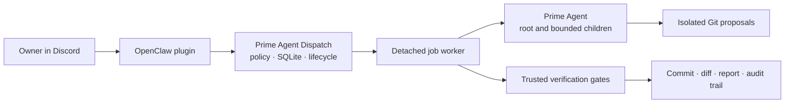

# Prime Agent Dispatch

A durable, policy-bound control plane and OpenClaw plugin for running [Prime Agent](https://github.com/PrimeIntellect-ai/prime-agent) coding jobs.

Prime Agent Dispatch turns an owner-confirmed task into a detached Git workflow: it selects an authorized repository, resolves an immutable base commit, runs Prime in isolated worktrees, applies trusted verification gates, commits successful changes, and preserves the complete result and audit trail. Jobs remain inspectable and controllable across later OpenClaw or CLI invocations.

> [!WARNING]
> Prime Agent currently runs through the `unsafe-local` backend as the OpenClaw operating-system user. Worktrees provide Git isolation, not filesystem, process, or network containment. Use only disposable fixtures or repositories whose content and dependencies you fully trust.

## What it provides

- Native online and offline OpenClaw plugin packages installed with `openclaw plugins install`.
- Detached, reconnectable jobs with transactional SQLite state and inspectable result artifacts.
- Host-owned repository policy, immutable request previews, and hash-bound owner confirmation.
- Checksum-pinned, target-specific Prime runtime artifacts and scoped inference credentials.
- Root and child-agent worktrees whose changes remain proposals until attributable integration.
- Bounded retries, inference allocation, verification gates, cancellation, safe resume, and evidence-preserving cleanup.
- Owner-only OpenClaw tools for start, resume, status, steering, cancellation, and results.

## How it fits together



Prime Agent is the coding runtime. Prime Agent Dispatch supplies the trusted orchestration around it; OpenClaw supplies owner identity, interaction, credentials, and delivery.

## Install the OpenClaw plugin

Release candidates are published as immutable GitHub Releases with checksums, SPDX SBOMs, build provenance, and SBOM attestations. Prefer the offline artifact for the smallest installation trust surface.

Requirements:

- OpenClaw `2026.7.1`
- A package built for the host platform, architecture, and exact Node version
- Git

Download the release assets, verify them, and install either the online or offline artifact:

```bash
gh release download v0.1.0-rc.1 \
  --repo feniix/prime-agent-dispatch \
  --pattern 'prime-dispatch-openclaw-*.tgz' \
  --pattern SHA256SUMS

shasum -a 256 -c SHA256SUMS
gh attestation verify \
  prime-dispatch-openclaw-v0.1.0-rc.1-darwin-arm64-node-24.18.0-offline.tgz \
  --repo feniix/prime-agent-dispatch

openclaw plugins install \
  ./prime-dispatch-openclaw-v0.1.0-rc.1-darwin-arm64-node-24.18.0-offline.tgz
openclaw gateway restart
```

The online package uses the same install command. It installs its locked production dependencies and downloads the checksum-pinned Prime runtime on first startup. The offline package contains both and makes no installation or startup network calls.

The plugin creates private runtime, configuration, and state under `$OPENCLAW_STATE_DIR/prime-dispatch`. A new installation authorizes no repositories. Before launching a job, configure `plugins.entries.prime-dispatch.config.hostPolicy` through normal OpenClaw configuration:

```json
{
  "repoRoots": ["/absolute/path/to/source"],
  "multiChild": false,
  "repositories": [
    {
      "path": "/absolute/path/to/source/repository",
      "fixture": true,
      "gates": [
        {
          "name": "test",
          "command": "/usr/bin/true",
          "args": [],
          "timeoutMs": 1000
        }
      ]
    }
  ]
}
```

Repository authorization is desired-state configuration: removing `hostPolicy` revokes previously configured repository access. See [OpenClaw deployment](docs/openclaw-host-lifecycle.md) and the [plugin reference](openclaw-plugin/README.md) for complete behavior and package-building instructions.

## Compatibility and maturity

- Prime Agent: `0.8.0`, commit `8d7deeab5861bf9d77bde3d8511046a5c799818d`
- OpenClaw: `2026.7.1`
- Node.js: `24` or newer for development; deployment packages bind the exact Node version
- Package targets: currently native Darwin arm64; additional targets require native builders and matching Prime runtimes

The control plane is beta-quality and extensively tested, but broad rollout remains blocked on a contained execution backend. Read the [security assessment](docs/security-assessment/2026-08-27.md) before running non-fixture jobs.

## Development

This repository uses pnpm exclusively.

```bash
git clone https://github.com/feniix/prime-agent-dispatch.git
cd prime-agent-dispatch

corepack pnpm install --frozen-lockfile
corepack pnpm --dir openclaw-plugin install --frozen-lockfile
corepack pnpm run format
corepack pnpm run typecheck
corepack pnpm test
corepack pnpm run test:adapter
corepack pnpm audit --prod
```

Ordinary tests use deterministic fixtures and no real Prime binary or provider credential. Credentialed live acceptance is explicit and opt-in.

## Documentation

- [Technical overview and prototype status](docs/technical-overview.md)
- [OpenClaw deployment and package building](docs/openclaw-host-lifecycle.md)
- [Prime runtime artifacts](docs/prime-runtime-artifacts.md)
- [Release process and verification](docs/releases.md)
- [Security assessment](docs/security-assessment/2026-08-27.md)
- [Architecture decisions](docs/adrs/README.md)
- [Child Git integration](docs/child-git-integration.md)
- [Child runtime lifecycle and recovery](docs/child-runtime-lifecycle.md)
- [Database migrations](docs/database-migrations.md)
