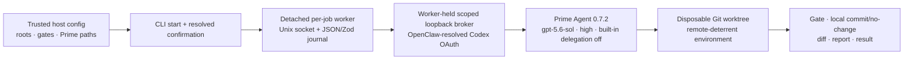

# Beta Milestone 1 report

Verdict: **COMPLETE for the disposable-fixture CLI scope**.

The milestone connects the existing detached JSON/Zod control plane to Prime Agent `0.7.2`, the Codex subscription through OpenClaw's public auth runtime, a scoped production inference broker, trusted host repository policy, immutable confirmation, local worktree/gates/commit/report, and bounded cancellation. The official release archive and configured Prime entrypoint are checksum-checked. The upstream archive omits runtime dependencies, so complete loaded dependency-tree integrity remains deferred. It does not install the later Discord/OpenClaw adapter and does not claim host containment.

## Implemented flow

## RED/GREEN evidence

| Slice                                             | RED                                                                                                                                                                        | GREEN                                                                                                                                                                                                                                          |
| ------------------------------------------------- | -------------------------------------------------------------------------------------------------------------------------------------------------------------------------- | ---------------------------------------------------------------------------------------------------------------------------------------------------------------------------------------------------------------------------------------------- |
| Release, environment, Git and confirmation policy | `node --test test/beta-policy.unit.test.js` failed because pinned release/policy exports did not exist.                                                                    | 4 focused tests passed; later Git-guard and commit-identity tests passed.                                                                                                                                                                      |
| Inference broker                                  | `node --test test/broker.unit.test.js` failed because `ProductionInferenceBroker` did not exist.                                                                           | Authorization/pinning/normalization, revocation/expiry/limits, cancellation, redaction and stream/tool observations passed.                                                                                                                    |
| Global lease and reconciliation                   | `node --test test/control-plane-beta.unit.test.js` failed because `GlobalJobLease` did not exist; the focused lifecycle test then showed a second active job was accepted. | Lease, host ceilings, missing-worker interruption, and one-global-job lifecycle passed.                                                                                                                                                        |
| Prime runtime                                     | `node --test test/prime-runtime.unit.test.js` failed because installation/config/launch helpers did not exist.                                                             | Checksum/version verification and fixed private Prime configuration passed.                                                                                                                                                                    |
| Confirmation                                      | `node --test test/confirmation.unit.test.js` failed because preview/confirmed start did not exist and CLI launched without confirmation.                                   | Resolved hash binding, refusal without confirmation, and explicit `--yes` fixture acceptance passed.                                                                                                                                           |
| Trusted host policy                               | `node --test test/host-config.unit.test.js` failed because host config loading/policy resolution did not exist.                                                            | Roots, gates and Prime paths resolve only from strict trusted config.                                                                                                                                                                          |
| Live Prime                                        | First live run failed on macOS Unix-socket path length; the next exposed a fixture gate path typo (`/usr/bin/test` instead of `/bin/test`).                                | Production opt-in test passed with a real streamed tool call, high reasoning, file edit, trusted gate, dedicated unsigned commit, report and inert remote. A separate live cancellation recorded one aborted upstream and no remaining worker. |

No intentionally failing state was committed.

## Review hardening

A final adversarial review produced additional RED/GREEN slices before integration:

- Confirmation hashes now bind the complete normalized prepared request, mutation after preview is rejected, and the unconfirmed dispatcher launch path was removed.
- The wall-clock deadline covers provisioning, Prime, gates, and commit/report processing. Cancellation aborts active gates and applies the configured grace period before killing the process tree.
- Git transport is deterred through both the wrapper and inherited `protocol.allow=never`. This is not enforceable when model code invokes an absolute Git binary with configuration overrides under normal host networking.
- Dead global-lease owners are reclaimed atomically, workers claim leases with their own PID, and queued jobs with dead launch owners reconcile to `interrupted`.
- Worker control sockets live in private `0700` directories, use `0600` socket permissions, and reject commands larger than 64 KiB.
- Active inference requests are aborted when their lease expires, and actual Prime `turn_start` events enforce the assistant-turn ceiling.
- The event-tail recovery test now waits for the terminal journal checkpoint rather than racing the terminal state snapshot.

## Live acceptance evidence

- Test command: `PRIME_DISPATCH_LIVE_ACCEPTANCE=1 node --test test/live-prime.acceptance.test.js`
- Result: 1/1 passed in approximately 14 seconds.
- Prime release checksum: `bc5471f2a626d727b88a45eb745fff93b10c554a3c4fc5912f25d8c64b987f5e`.
- Prime executable checksum: `a6144570af2554b537530372cb3080b4f7713875e8d9d4677e453bb1040f1ec5`.
- Inference event: two authorized requests; streaming, function-call event and high reasoning all observed.
- Result: trusted `fixture-output` gate passed and a local commit was created as `Prime Dispatch <prime-dispatch@local.invalid>`, unsigned.
- Remote proof: the configured `https://example.invalid/never-contact.git` remained unchanged; the source checkout remained clean.
- Cancellation exercise: terminal `cancelled`; broker recorded `abortedUpstreams: 1`; no Prime/worker process remained.
- Deterministic verification after review remediation: 65 tests passed with the opt-in live test skipped; the real disposable-fixture acceptance also passed after process-quiescence and two-step confirmation changes.

## Remaining risks

- Unsafe-local current-user execution is not a sandbox and retains normal host networking.
- Git remote blocking and a hard single-process/root boundary cannot be enforced by environment variables while Prime has IPython and normal host networking.
- Token usage is observable only after an upstream response, so one response can overshoot remaining budget and aborted usage can be absent.
- The official Prime archive lacks runtime dependencies; a separately checksum-pinned self-contained runtime is required for complete launch integrity.
- Worker death is preserved as interrupted; automatic transcript resume is deferred.
- The Discord/OpenClaw adapter and editable status card are outside Milestone 1.
- Storage quota/eviction and container execution remain later milestones.

The [deep-review catalog](beta-milestone-1-review.md) records the resolved findings and issue-ready deferred work.
