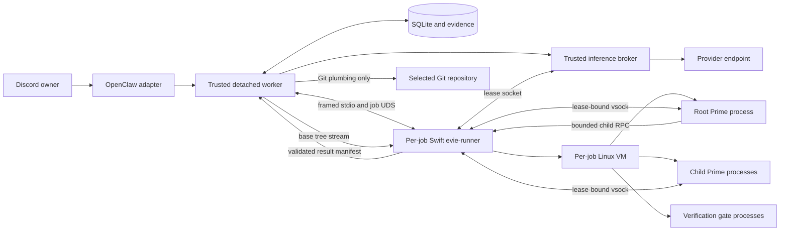

# Contained Execution Backend Implementation Plan

This document expands
[Workstream 2](./remediation-plan.md#workstream-2-implement-a-contained-execution-backend)
into a concrete implementation design. Its purpose is to close PD-01 without
weakening Prime Dispatch's existing confirmation, inference, child lifecycle,
recovery, evidence, and cleanup guarantees.

The supporting
[grounding and validation record](./contained-execution-backend-grounding.md)
separates repository facts, upstream-documented tool capabilities, observed
review-host facts, unresolved deployment assumptions, and hypotheses that must
be proved by a spike. The architecture below is a proposal until those gates
pass.

## Deployment decision

The target is Evie Platform's dedicated Apple-silicon Mac Mini running macOS
Tahoe. Implement v1 as an Evie Platform specialization of RFD-021 with:

- **Apple's `apple/containerization` Swift package**, pinned to an exact tested
  version, used directly by a small `evie-runner` helper;
- **one fresh lightweight Linux VM per Prime job**. The trusted detached worker
  spawns one runner process, the runner owns one VM, and killing either tears
  down the entire untrusted process tree;
- **no `container` CLI or `container-apiserver` on the host execution path**.
  The CLI remains a release-time image tool because its per-user LaunchAgent/XPC
  model does not fit Evie's LaunchDaemons;
- **no Colima, Docker daemon, container-engine socket, or shared workload
  kernel**. Root, children, dependency scripts, and gates run as separate
  processes/workspaces inside the same job VM;
- **no guest NIC for Prime v1**. Prime already has a host-side streaming
  inference broker, so a fixed vsock relay can provide broker-only inference
  without reproducing RFD-021's general-purpose CONNECT proxy and guest-visible
  provider credential;
- **a per-job source tree outside the agent's normal `~/src/<repo>` checkout**,
  shared only as `/work` after a non-local, no-hardlink copy and strict manifest
  validation. A block-backed workspace replaces virtiofs if its spike exposes
  any path outside the share;
- **an immutable OCI image selected by digest**, built from a `Containerfile`,
  scanned, given an SBOM, signed, and installed into a root-owned content store;
- **a strict framed stdio/Unix-socket protocol** between the TypeScript worker
  and Swift runner. The caller supplies a signed manifest and opaque IDs, never
  arbitrary VM, mount, image, process, or network configuration;
- **Git plumbing plus a content-addressed result manifest** for final
  integration, avoiding repository hooks, filters, credential helpers, and
  shell execution in the trusted control plane.

This supersedes the earlier Colima recommendation. ADR-0043 merely freed Colima
for a possible sandbox; it did not select it. The newer, workload-specific
RFD-021 rejects shared-VM stacks because a container escape lands beside every
other workload. Its selected mechanism is the underlying
`apple/containerization` library, not the Apple `container` CLI.

The runtime remains a proposal until it passes the executable spike on real
Apple-silicon hardware. RFD-021 is still Draft/Discussion, so this plan must
track its final ADR. The backend must fail closed if the runner signature,
library/kernel/init identity, image, policy, filesystem share, vsock binding, or
VM teardown evidence is wrong. It must never fall back to `unsafe-local`.

## Why these tools

| Tool or approach                 | Decision        | Reason                                                                                                      |
| -------------------------------- | --------------- | ----------------------------------------------------------------------------------------------------------- |
| `apple/containerization` library | Use for v1      | Per-job VM, in-process ownership, vsock, OCI/ext4, CPU/memory limits, and no daemon/LaunchAgent dependency. |
| Swift `evie-runner`              | Use             | Directly consumes the library and matches RFD-021's lifecycle owner.                                        |
| Apple `container` CLI            | Build tool only | Same underlying VM technology, but its LaunchAgent/XPC service conflicts with Evie's LaunchDaemons.         |
| Colima/Docker/Podman machine     | Do not use      | Workloads share a Linux kernel and require a high-authority daemon/socket.                                  |
| Existing Prime inference broker  | Use via vsock   | Already handles credentials, streaming, quotas, model binding, expiry, and revocation.                      |
| `Containerfile` + OCI archive    | Use             | Reproducible image built off-host and installed by digest without job-time pulls.                           |
| Syft + Grype                     | Use in release  | Generate an SBOM and enforce the reviewed vulnerability policy.                                             |
| Cosign                           | Use in release  | Sign the image digest and attach SBOM/provenance attestations.                                              |
| Kubernetes                       | Do not use      | Adds a cluster control plane to a single-host detached-job problem.                                         |

If a later workload requires macOS, add a separate Tart/direct-VZ tier. Do not
weaken the Linux VM profile or reintroduce a shared container daemon.

## Security boundary and process ownership

Separate the system into three trust levels:

1. **OpenClaw adapter and trusted control worker**
   - Owns authorization, confirmation, host policy, provider authentication,
     inference accounting, the SQLite authority, and durable evidence.
   - Can call the narrow runner API.
   - Never executes repository code, Prime SDK code, gates, dependency scripts,
     or Git hooks.
2. **Per-job Swift `evie-runner` process**
   - Is a trusted child of the detached worker and owns exactly one VM.
   - Loads only the root-owned policy, signed image, kernel, and init artifacts.
   - Converts the admitted job manifest into fixed VM/process operations.
   - Accepts opaque IDs and streamed content, never caller-selected host paths,
     images, mounts, network options, or arbitrary host commands.
3. **Untrusted per-job Linux VM**
   - Runs Prime, IPython, children, gates, package lifecycle scripts, and
     job-local Git operations.
   - Receives no provider credential and no route to the internet or host.
   - Can reach only the job workspace and scoped vsock endpoints.



The runner is a trusted host component in the detached worker's process tree,
not another isolation boundary. It may run as `_evie-agent`, as RFD-021
proposes, because untrusted code runs only in the VM and no container-engine
socket exists. `_evie-agent` may execute but must not modify the root-owned
runner binary, library/kernel/init artifacts, policy, or image store. Every
launch is bound to the worker's immutable confirmed manifest.

The current global one-job lease reduces cross-job exposure in the first
release. Root, child, and gate processes share the job VM kernel, so their
separation is workflow integrity, not a security boundary. Give them separate
work directories, HOME/state, process groups, and inference leases. If
mutually hostile children become a requirement, allocate a VM per child and
revisit the memory budget.

## Host prerequisites and layout

Require and audit:

- macOS 26 on Apple silicon with `kern.hv_support = 1`;
- exact pinned `apple/containerization`, guest kernel, `vminitd`, OCI runtime,
  and Swift runner identities;
- a runner signed with `com.apple.security.virtualization` and verified before
  launch;
- root-owned, signed OCI archives plus root-owned kernel/init/policy artifacts;
- a fixed per-VM CPU, memory, rootfs, work, scratch, and wall-clock budget;
- no network interface for Prime v1 and one allowlisted vsock service family;
- host memory admission sized against RFD-021's observed 16 GB/10-core Evie
  host: about 9.7 GB committed and about 6 GB remaining before workloads.

Recommended layout:

```text
/opt/evie/bin/evie-runner                       root:wheel 0755 signed
/opt/evie/etc/dispatch/prime-policy.json        root:wheel 0644
/opt/evie/var/dispatch/images/                  root:wheel 0755
  <image-digest>.oci                            root:wheel 0444 signed
  kernel/<digest>/                              root:wheel 0555
  init/<digest>/                                root:wheel 0555
/opt/evie/var/dispatch/inbox/<repo>.git         trusted bare quarantine repo
/var/lib/evie-agent/src/.jobs/<job-id>/         _evie-agent private per-job tree
  work/                                         only candidate virtiofs share
  state/                                        job-private HOME/XDG state
  scratch/                                      bounded disposable storage
```

The OpenClaw installation command must not silently create system users or
install system services. Add a separate operator-reviewed runner installation
flow that requires administrative authority, then make the existing lifecycle
audit verify the installed runner without mutating it.

### Process ownership and launchd integration

Do not add a runner LaunchDaemon or Apple `container` LaunchAgent. The existing
trusted detached worker, or the RFD-021 `evie-dispatch` LaunchDaemon when that
service lands, spawns one `evie-runner` child per admitted job. The runner must
set parent-death handling, own the VM object directly, and stop the VM on normal
exit, timeout, signal, protocol failure, or parent connection loss.

Stopping the owning LaunchDaemon must eliminate every runner and VM without an
orphan sweep. The physical-host spike must prove that invariant. Record the
owning plist, dispatcher/worker, runner signature, Swift package resolution,
kernel/init/image, policy, and job-manifest digests in evidence.

## Runner API

### Transport

Spawn the signed runner with literal argv and use a versioned framed protocol
over inherited stdin/stdout plus a dedicated bounded event file descriptor:

- the first frame contains the confirmed job-manifest digest and a one-time
  random session capability inherited through a pipe, not argv or environment;
- every command/event has a strict Swift schema mirrored by strict Zod schemas;
- each frame declares type and length, with small control-frame limits,
  backpressure, monotonic sequence numbers, and a transcript hash;
- runner IDs, VM IDs, vsock ports, and guest identities are generated by the
  runner;
- the caller supplies only opaque job/attempt IDs and policy IDs. The runner
  derives paths beneath the fixed jobs root and resolves image/kernel/init from
  root-owned policy;
- EOF, malformed frames, sequence gaps, digest mismatch, or parent death stops
  the VM and yields interrupted evidence.

Do not expose a general host RPC listener, XPC service, container-engine socket,
or TCP port. A job is owned by one parent process and one protocol session.

### Minimal API surface

Implement these protocol operations, following RFD-021's runner interface:

```text
hello
provision
start
observe
signal
wait
collectEvidence
stop
```

Semantics:

- `provision` verifies the signed policy/image/kernel/init identities, derives
  the admitted per-job directories, constructs the VM, and reports its immutable
  identity without starting untrusted code.
- `start` accepts only a fixed role enum and approved entrypoint. Root, child,
  and gate commands are mapped from policy rather than accepted as a shell.
- `observe` emits bounded structured lifecycle/resource events. Raw guest output
  goes to a redacted operator-only job log and never returns to OpenClaw.
- `signal` accepts only `steer`, `abort`, `term`, or `kill` as allowed by the
  current role/state.
- `wait` reports a bounded structured exit result.
- `collectEvidence` becomes available only after all guest processes are
  quiescent and returns the VM/resource/mount/vsock/result identities.
- `stop` is idempotent, stops the complete VM, and returns teardown proof.

### Policy object

The trusted worker selects a host-owned policy ID. Runnerd loads the actual
policy from root-owned configuration. The request cannot provide weaker
values.

```ts
type ContainmentPolicyV1 = {
  id: "prime-macos-containerization-v1";
  containerizationVersion: string;
  kernelDigest: `sha256:${string}`;
  initDigest: `sha256:${string}`;
  imageDigest: `sha256:${string}`;
  network: "vsock-only";
  sharedPaths: ["work", "state", "scratch"];
  readOnlyRootfs: true;
  maxMemoryBytes: number;
  maxCpus: number;
  maxWorkspaceBytes: number;
  maxOutputBytes: number;
  maxRuntimeMs: number;
};
```

Runnerd returns the fully resolved policy plus image ID/digest. Store its
canonical digest in the preview, confirmation hash, job request, attempt,
checkpoint, result, and audit event. Resume fails if it changes.

## Source projection

Never mount `~/src/<repo>` or its `.git` into the VM. Create a complete
independent job clone beneath the fixed jobs root before VM launch:

```text
git clone --no-hardlinks --no-local <selected-repo> <jobs-root>/<job-id>/work
git -C <job-work> checkout --detach <confirmed-base>
```

Then:

1. Revalidate the canonical repository, base commit/tree, object format, and
   confirmed manifest immediately before cloning.
2. Reject local alternates, replace refs, external object directories,
   submodules, suspicious Git config, non-UTF-8 paths, and unsupported modes.
3. Prove the job clone has no hardlinks to the selected repository, no
   `objects/info/alternates`, no gitfile/symlink `.git`, and no symlink beneath
   `.git/objects`.
4. Generate a canonical source manifest of path bytes, mode, Git object ID,
   SHA-256, and size. Store its digest in the job manifest.
5. Share only `<job-id>/work`, `state`, and `scratch` with the VM. Do not share
   the jobs-root parent, agent HOME, `/opt/evie`, the selected repository, or
   another job. Use read-only rootfs plus explicit virtiofs shares; switch work
   to a fixed-size ext4 block image if the spike cannot prove share confinement.
6. Inside the VM, initialize child worktrees and job-local branches. The host
   performs no Git command in the untrusted clone while the VM is live.
7. After VM teardown, reject gitfiles, alternates, symlinked objects, and
   identity drift before reading any result. Import through `file://` into a
   bare quarantine repository with hooks disabled and object fsck enabled, or
   consume the stricter content-addressed result manifest below.

The selected repository remains byte-identical and never receives the job
branch or attacker-authored Git configuration. Dirty selected-checkout content
remains excluded, matching current behavior.

Dirty source-checkout content remains excluded, matching current behavior.
Git LFS pointers remain inert pointer files because the container has no
network access.

## Container image

Add a root-owned, digest-pinned image containing only:

- Node.js 24 and the verified Prime-compatible runtime requirements;
- Python and IPython versions pinned through a hash-locked build input;
- Git and the minimum shell/runtime utilities required by supported gates;
- the `container-entry` program and fixed vsock bridges;
- CA certificates only if the build or tooling requires them; runtime egress is
  still disabled;
- a non-root `prime` user and an empty writable home supplied at runtime.

Do not include SSH clients, cloud CLIs, container clients, init systems beyond
the pinned `vminitd`, compilers
not required by supported repositories, or package-registry credentials.

Build requirements:

- pin the base image by digest;
- pin OS package sources to a reproducible snapshot where practical;
- lock Python wheels with hashes and use `--require-hashes`;
- keep the existing Prime runtime artifact content verification; either copy
  the artifact into the image at release time or mount the verified artifact
  read-only by digest;
- generate an SBOM with Syft;
- scan the final image and SBOM with Grype using a documented severity and
  exception policy;
- sign the image digest and attach SBOM/provenance attestations with Cosign;
- build the OCI archive with Apple `container` on the release machine, not the
  gateway host;
- make `evie install` verify signature/digest before placing the archive in the
  root-owned content store;
- make the runner accept only the policy-pinned digest. Network retrieval must
  never occur during admission or launch.

Automate digest updates through reviewable pull requests. Never accept an
image tag in host config or a job request.

## VM runtime policy

The Swift runner constructs `LinuxContainer.Configuration` and VZ resources
from the root-owned policy. No equivalent command template is caller-visible.

Required invariants:

- one VM per job and no VM reuse across jobs;
- no NIC, NAT, bridged interface, DNS, host port, SSH agent, host credential,
  arbitrary virtiofs path, inherited host environment, or device passthrough;
- read-only digest-pinned rootfs; bounded `/work`, `/state`, and `/scratch`;
- fixed CPU count, memory ceiling, disk ceilings, and host-owned wall clock;
- workload processes run as a fixed non-root UID, while all controls assume a
  guest-root attacker;
- image, kernel, init, entrypoints, mounts, vsock services, and resources come
  only from root-owned policy;
- evidence includes job, attempt, role, policy/image/kernel/init digests, VM
  identity, share identities, vsock bindings, and start timestamp.

Virtualization.framework is the host boundary. Guest namespace/cgroup settings
are defense in depth, not host enforcement. The runner must stop and destroy the
whole VM whenever lifecycle or guest-state proof is ambiguous.

## Inference path with no container network

The existing broker should remain in the trusted worker because it holds the
provider access token and authoritative usage callbacks.

Use Virtualization.framework vsock, which `apple/containerization` and
`vminitd` already use for host/guest control:

1. The trusted worker creates one inference lease per root/child and retains
   the provider credential in the existing broker.
2. The runner allocates a runner-generated vsock port and binds it to exactly
   one lease and guest identity. The job manifest records the binding, not a
   caller-selected port.
3. A fixed guest bridge listens only on that vsock endpoint and exposes Prime's
   expected loopback HTTP API. It accepts no hostname, destination, CONNECT,
   DNS, filesystem, or generic proxy command.
4. Runnerd forwards framed bytes between vsock and the trusted broker's Unix
   socket. The guest receives only the existing scoped bearer token, never the
   provider credential.
5. The broker continues to enforce token digest, job/child binding, model,
   reasoning, concurrency, bytes, request/token budgets, expiry, SSE bounds,
   redirects, and revocation.

The bridge has no destination parameter, DNS resolver, CONNECT support,
generic proxy behavior, or filesystem browsing. If vsock setup fails, the job
fails; the runner must not add a NIC, proxy, host port, or broader mount as a
fallback.

Test from inside the VM that internet, DNS, host loopback, RFC 1918, link-local,
IPv6, Tailscale/LAN, cloud metadata, and arbitrary vsock/Unix endpoints fail
while the scoped broker request succeeds.

## Root-agent execution

Move all Prime SDK loading and environment mutation out of `src/worker.ts` and
into `container-entry`:

1. The trusted worker prepares host policy, broker lease, source artifact, and
   runner workspace.
2. The Swift runner boots the per-job VM and starts the fixed `prime-root`
   entrypoint with the admitted work/state/scratch shares and vsock bindings.
3. `container-entry` constructs a strict environment from constants and
   host-approved values. It must not inherit the worker/runner environment.
4. The entrypoint verifies the mounted runtime/image identity and workspace
   manifest, writes the private Prime model configuration, loads the SDK, and
   exposes only IPython plus the remote child host.
5. Agent JSONL/events stream through the runner to the trusted worker with the
   existing byte limits and hashing behavior.
6. Steering and cancellation travel through the runner API to the entrypoint.
7. Completion is not trusted until the runner proves all guest processes are
   quiescent, stops the VM, closes every vsock binding, and seals the job tree.

The container environment allowlist should contain only locale, minimal PATH,
job-private HOME/TMPDIR, fixed runtime paths, job/attempt IDs, the local broker
URL, scoped broker token, fixed provider/model/reasoning, and bounded child
policy. Tests should seed the worker environment with fake OpenClaw, AWS, GCP,
Azure, SSH, GitHub, package-registry, CI, proxy, and database secrets and prove
none appears in the container.

## Child execution

Preserve durable child admission in the trusted worker, but replace in-process
child sessions with a remote runtime:

- `container-entry` in the root implements Prime's `subagentRuntimeHost` with a
  `RemoteRlmHostProxy` over a fixed child-control vsock service.
- The trusted worker exposes only bounded `run`, `inspect`, and `cancel`
  operations on that socket. It reuses `BoundedRlmHostBridge` for prompt,
  model, reasoning, dependency, concurrency, retry, and lifecycle admission.
- Replace `GatedPrimeSubagentHost`'s in-process `PrimeSession` implementation
  with a `ContainedNativeRlmRuntime` that asks the runner to create a child
  workspace and start a `prime-child` process inside the same job VM.
- The child workspace is projected from the admitted root wave base, not
  bind-mounted from the root workspace.
- The child receives only its worktree, child-specific inference lease, private
  HOME/TMPDIR, and event channel. It does not receive the root child-control
  socket.
- On success, the guest coordinator exports a bounded proposal manifest and
  blobs. The
  trusted child coordinator verifies base identity and digest, then asks
  the runner's trusted guest-side coordinator to integrate the proposal into
  the root workspace. Git commands run with hooks, filters, remotes, helpers,
  pagers, and editors disabled.
- Stop the root process while the coordinator snapshots a wave base or
  integrates a child proposal. Revalidate root HEAD and worktree state before
  and after the operation, then resume it. This prevents a daemonized root
  tool from racing the trusted child integration while the SDK awaits the
  child result.
- The root sees the new wave base only after durable integration evidence is
  committed, matching current ordering.
- Child cancellation terminates the child process group and revokes only its
  lease. Root/job cancellation destroys the whole VM.

Root and child workspaces must remain separate directories with mediated
proposal integration. They share a VM and kernel in v1; do not report this as a
security boundary.

## Verification gates and dependencies

Run each gate as a fresh `verification-gate` process inside the still-owned job
VM after Prime and all children are quiescent. The gate command and argv
come only from the confirmed host policy, but execute inside containment because
repository code and dependency scripts remain hostile.

Each gate gets:

- the root workspace and a new private HOME/TMPDIR;
- no broker socket and no child-control socket;
- no network;
- its own process group and timeout under the VM-level resource ceiling;
- bounded stdout/stderr retained in the operator-only job log;
- no inherited environment or credentials.

Dependency handling must not reintroduce general egress. Recommended flow for
pnpm repositories:

1. In a separate credential-free dependency-build container, fetch only from a
   host-approved registry proxy using the confirmed lockfile.
2. Use `pnpm fetch --frozen-lockfile --ignore-scripts` to populate a
   content-addressed store.
3. Record the lockfile digest, registry identity, package integrity records,
   store artifact digest, and scanner result.
4. Mount the verified store read-only into the job container and run
   `pnpm install --offline --frozen-lockfile`; lifecycle scripts execute only
   inside containment.
5. Never mount the operator's normal pnpm/npm cache or `.npmrc`.

For the first milestone, support only repositories whose dependency artifact
is prepared ahead of the job. Treat on-demand registry access as a later,
separately reviewed feature. If added, route it through an allowlisting package
proxy with no internal-network reachability, not normal container egress.

## Result export and trusted Git integration

Do not copy a runner-created `.git` directory or import arbitrary refs directly
into the selected repository. Export a narrow content-addressed tree delta:

```ts
type ContainedResultManifestV1 = {
  schemaVersion: 1;
  jobId: string;
  attemptId: string;
  originalBaseSha: string;
  originalBaseTreeSha: string;
  syntheticBaseSha: string;
  runnerHeadSha: string;
  runnerTreeSha: string;
  policyDigest: string;
  imageDigest: string;
  entries: Array<{
    path: string;
    operation: "add" | "modify" | "delete";
    mode?: "100644" | "100755" | "120000";
    size?: number;
    sha256?: string;
  }>;
  totalBytes: number;
};
```

Integration sequence:

1. Stop every root, child, and gate process, collect runner evidence, then stop
   the VM before the host reads the job tree.
2. Reject the job clone if `.git` is not a plain directory, alternates exist,
   object paths are symlinks, or source/job identity changed. Fetch only through
   `file://` into the bare quarantine repo with hooks disabled and
   `fetch.fsckObjects`/`transfer.fsckObjects` enabled.
3. Revalidate manifest ownership, policy/image identity, base commit/tree,
   path rules, modes, counts, per-file size, total size, and blob digest.
4. Re-read the selected repository and prove that the confirmed base commit and
   target branch have not changed.
5. Use a temporary Git index seeded with the base tree. For each changed blob,
   call `git hash-object -w --stdin` with literal argv and update only the
   corresponding cache entry. Do not pass a path to `hash-object`, which avoids
   clean filters.
6. Use `git update-index --cacheinfo`, `git write-tree`, and `git commit-tree`
   with fixed attribution and parent. These plumbing commands do not run hooks.
7. Compare the constructed tree to an independently reconstructed result tree
   from the manifest.
8. Atomically create/update only the owned `refs/heads/prime/<job-id>` ref with
   the expected old value.
9. Materialize the owned result worktree with a secure file writer that never
   follows symlinks and refuses path changes after validation. Do not use a Git
   checkout if repository config can enable external filters.
10. Record the host commit SHA, manifest digest, per-blob digests, and runner
    identities in the terminal transaction.

Run Git with `GIT_CONFIG_NOSYSTEM=1`, `GIT_CONFIG_GLOBAL=/dev/null`, disabled
credentials/remotes, no pager/editor/signing, and an empty root-owned
`core.hooksPath`. Extend repository admission to reject local `include` and
`includeIf` directives, alternates, replace refs, external object directories,
`core.fsmonitor`, `core.sshCommand`, external diff/text conversion, every
`filter.*` driver, and other configuration that would execute programs during
trusted-side operations.

Initially reject symlink changes if the secure materializer cannot provide
race-free beneath-root operations. The trusted materializer runs on macOS, so
do not specify Linux `openat2()` for this path. Use a small audited Rust or Swift
helper that walks from an already-open root directory descriptor with Darwin
`openat()`/`fstatat()`, `O_NOFOLLOW`, `AT_SYMLINK_NOFOLLOW`, and atomic
`renameat()` operations. Revalidate every opened component and never resolve a
caller-controlled absolute path.

This approach preserves an automatic local commit without executing runner
code or repository hooks as the OpenClaw user. Child commit SHAs remain runner
evidence; the trusted repository receives one attributable final commit. If
preserving the exact child commit graph is a product requirement, design and
review a separate strict pack-import protocol later.

## Cancellation, interruption recovery, and cleanup

Extend durable identity with:

- runner protocol/version/signature and process identity;
- workspace ID and source-manifest digest;
- runtime IDs for root, children, and gates;
- VM identity, `apple/containerization`/kernel/init/image/policy digests,
  resource/share/vsock identities, role, and start timestamp;
- broker and child-control vsock lease IDs, never their bearer values;
- last event sequence and sealed/result state.

RFD-021 intentionally has no resumable guest state. If the worker/dispatcher or
runner connection dies, the runner must stop with its VM and the attempt becomes
interrupted. Reconciliation compares durable job/runner/VM/artifact identities
and teardown evidence; it never silently recreates a VM or resumes Prime. A new
attempt requires normal admission and owner policy.

Cancellation order:

1. revoke the applicable inference lease;
2. send the structured Prime abort;
3. wait the confirmed grace period;
4. terminate the complete VM through its owning runner;
5. kill the runner if graceful VM stop exceeds the host deadline;
6. prove the runner and VM no longer exist and every vsock/virtiofs handle is
   closed;
7. seal or quarantine the job directory and persist teardown evidence.

The worker performs cleanup by opaque job/runtime ID and derives all paths
beneath the fixed jobs root. It revalidates ownership, canonical location,
share/VM state, and artifact identity immediately before deletion. The cleanup
plan records exact objects and requires a new snapshot if identity changes.

On service startup, the worker inventories runner children, job directories,
and quarantine state. Unknown, corrupt, running-without-authority, or mismatched
objects are quarantined or stopped, never adopted based on a path/name alone.

## Data model and migration

Add explicit schemas rather than overloading the current host worktree fields:

- `execution_backends`: backend kind, policy ID/digest, image digest, runner
  protocol, and resolved platform capabilities;
- `runner_workspaces`: opaque ID, role, original base identity, source digest,
  synthetic base, lifecycle state, and seal/result digests;
- `runner_runtimes`: opaque ID, runner/VM identity, role,
  library/kernel/init/image/policy digests, event cursor, and teardown evidence;
- child worktree identity v2: runner workspace ID instead of a host path;
- checkpoints for source export/upload/seal, runtime create/start/quiesce,
  result export/verify, trusted tree construction, ref update, and materialize;
- terminal result fields for containment policy, image, runner, source, result,
  and teardown evidence.

Keep old unsafe-local jobs readable. Migration must not reinterpret their host
worktree paths as contained workspaces. Contained attempts with a lost runner
or VM are marked interrupted; they are not resumed in a replacement guest.

## Code changes

### New modules

- `src/runner-protocol.ts`: strict request/response/event schemas.
- `src/runner-client.ts`: Swift-child spawning, framed protocol, event stream,
  transcript digest, parent-death, and failure handling.
- `src/contained-execution.ts`: `ContainedExecutionBackend` orchestration.
- `src/contained-source.ts`: canonical Git tree export and manifest.
- `src/contained-result.ts`: result verification and trusted Git plumbing.
- `src/contained-broker.ts`: per-lease Unix-socket/vsock bridge lifecycle.
- `src/contained-child-runtime.ts`: trusted `NativeRlmRuntime` backed by the
  per-job VM runner.
- `src/contained-job-tree.ts`: independent clone creation, manifesting,
  pre/post-VM validation, quarantine import, quotas, and deletion.
- `src/runner/container-entry.ts`: fixed guest root/child/gate entrypoints.
- `src/runner/remote-rlm-host.ts`: root-process child RPC proxy.

The Swift implementation belongs in Evie Platform:

- `packages/runner/`: pinned `apple/containerization` dependency, signed
  `evie-runner` executable, strict protocol types, policy loader, VM lifecycle,
  shares, resources, vsock bridges, process execution, and evidence collection;
- runner tests derived from Apple's `cctl` example but using only Evie's fixed
  policy surface.

### Existing modules

- Expand `src/execution.ts` from worktree preparation to the full runner
  lifecycle and add a backend discriminator.
- Refactor `src/worker.ts` so Prime, children, and gates are invoked only
  through `ExecutionBackend`; keep provider auth and SQLite outside it.
- Split `src/prime-sdk.ts` into guest-side session code and trusted-side
  child admission. Remove `process.env` mutation from the trusted worker.
- Replace host paths in `src/child-git.ts` with workspace identities and
  runner-side proposal/integration calls.
- Preserve `src/child-host-bridge.ts` policy checks while swapping in the
  contained runtime.
- Add runner-vsock relay support to `src/inference.ts` without weakening the
  existing HTTP validation.
- Extend `src/schemas.ts`, `src/store.ts`, `src/sqlite.ts`, migrations,
  interrupted recovery, cleanup, artifacts, and presentations with containment
  identity.
- Extend `src/openclaw-install.ts` audit to verify runner availability and
  policy, but keep privileged runner installation separate.
- Harden trusted Git operations in `src/process.ts` and repository admission.

Do not let `ContainedExecutionBackend` become a thin worktree creator followed
by the existing host-side `AgentBackend` and gate calls. The backend boundary
must encompass every repository-influenced executable operation.

### Evie Platform provisioning changes

Implement privileged host integration in `evie-platform`, not in an OpenClaw
plugin installation hook:

- finalize RFD-021 and record the validated mechanism in an ADR before enabling
  real jobs;
- build the Swift runner on the release machine with Xcode 26, pin
  `apple/containerization`, ad-hoc sign with the virtualization entitlement,
  and ship the binary in the Evie release; gateway hosts need no Xcode;
- build OCI archives with Apple `container` on the release machine, then have
  `evie install` verify signature/digest and place image/kernel/init artifacts
  in root-owned read-only storage;
- deploy root-owned policy containing resource, share, entrypoint, artifact,
  and vsock allowlists;
- extend the verify role to check runner signature/entitlement, package/artifact
  digests, hypervisor support, job-root/quarantine modes, and a no-NIC/vsock
  malicious canary;
- integrate Prime with RFD-021's `evie-dispatch` lifecycle rather than creating
  a competing VM supervisor when the daemon lands;
- add an upgrade hold-down: stop admission, drain/cancel jobs, replace and
  verify runner/artifacts, then re-enable only after the canary passes.

The Prime Dispatch repository owns its protocol client, Prime entrypoint,
broker/vsock specialization, result handling, and deterministic tests. Evie
Platform owns the Swift runner, image/artifacts, dispatcher lifecycle, macOS
provisioning, installation audit, and physical-host acceptance.

## Implementation milestones

### Milestone 2A: ADR and executable spike

Deliver:

- finalize RFD-021 and record the Prime-specific no-NIC/vsock decision in an
  ADR;
- pin `apple/containerization`, the Linux kernel, `vminitd`, base image, and
  entitlement-bearing Swift runner build;
- a minimal `evie-runner` child-process protocol and VM lifecycle;
- one malicious fixture VM proving read-only rootfs, declared-share-only
  writes, no NIC, broker-only vsock access, VM kill, and no surviving process;
- proof that `_evie-agent` cannot change the root-owned runner, policy, image,
  kernel, or init artifacts and the VM sees no undeclared host path;
- a documented fail-closed path when any artifact identity or runner
  entitlement drifts.

Exit criterion: the spike proves the security contract on the target host. Do
not merge a spike that uses host networking or broad mounts.

### Milestone 2B: Runner protocol and workspace projection

Deliver:

- versioned schemas, peer checks, streaming limits, and policy resolution;
- canonical base-tree export/import;
- workspace quota, private Git initialization, sealing, and deletion;
- fake runner client for deterministic tests;
- crash injection at create/upload/seal boundaries.

Exit criterion: a malicious source tree cannot escape or alter runner-owned
metadata, and no caller-controlled macOS path reaches a VM share or artifact.

### Milestone 2C: Single-root Prime path

Deliver:

- root VM entrypoint;
- verified runtime/image selection;
- strict environment allowlist;
- no-NIC, lease-scoped vsock inference path;
- streaming events, steer, cancellation, quiescence, and result export;
- unsafe-local production kill switch.

Exit criterion: the existing live single-root fixture completes with network
disabled and fails every host credential/egress probe.

### Milestone 2D: Children and gates

Deliver:

- remote RLM host proxy;
- separate child directories/processes and per-child broker leases inside the
  same job VM;
- proposal integration and wave-base evidence;
- no-network gate processes inside the job VM;
- recursive cancellation and VM teardown evidence.

Exit criterion: deterministic and live multi-child behavior is preserved, and
root/child/sibling mount probes fail.

### Milestone 2E: Trusted integration, recovery, and lifecycle

Deliver:

- result manifests and content-addressed blobs;
- Git plumbing integration and secure materialization;
- migrations, interrupted-attempt handling, cleanup, orphan reconciliation,
  and fault injection;
- runner installer, audit, signed-image verification, SBOM, scanner policy,
  and operator docs.

Exit criterion: forced crashes at every checkpoint either roll back or preserve
unambiguous evidence, with no duplicate Prime call, gate, ref update, or result
commit.

### Milestone 2F: Adversarial acceptance and independent review

Deliver:

- disposable-host malicious fixture suite;
- resource-exhaustion, symlink/race, daemonization, Git execution, socket,
  network, metadata, and cross-workspace tests;
- measured teardown and quota evidence;
- independent security review and closure record for PD-01.

Exit criterion: every PD-01 closure criterion in the remediation plan is met.

## Test strategy

### Deterministic unit tests

- policy canonicalization and downgrade rejection;
- every runner API schema, unknown-field rejection, and size limit;
- Swift VM/process configuration generation from host policy with no
  caller-controlled paths, mounts, artifacts, devices, or network mode;
- source/result manifest path, mode, digest, count, and collision validation;
- broker socket lease binding and revocation;
- child RPC binding and cross-job/child replay rejection;
- event ordering, truncation, cursor, and digest behavior;
- migration compatibility and unsafe-local/non-contained recovery rejection.

### Integration tests with fake runtime adapters

- full worker state machine through a fake runner client;
- fault injection before and after each runner side effect;
- runner/VM substitution, image/policy/artifact drift, stale event stream,
  partial upload, and corrupted result behavior;
- root, child, gate, cancel, interrupted recovery, cleanup, and orphan
  reconciliation.

### `apple/containerization`/VZ acceptance tests

Run on a disposable, credential-free Apple-silicon Mac with the production
runner, entitlement, artifact, launchd-parent, and filesystem topology. Tart CI
cannot exercise this layer because Evie Platform has already established that
nested virtualization is unavailable. The fixture must attempt:

- reads of OpenClaw, runner, control database, SSH, cloud, package, GitHub, and
  host environment data;
- writes outside the workspace and into another root/child/sibling workspace;
- internet, DNS, localhost, private network, IPv6, metadata, and arbitrary UDS
  connections;
- `/proc` host inspection, ptrace, mount, namespace, BPF, device, and runtime
  control access;
- fork bombs, memory/disk exhaustion, oversized logs, and daemonization;
- Git hooks, filters, helpers, pagers, editors, alternates, replace refs, and
  malicious result paths;
- broker token reuse across root/child/job/expiry/revocation boundaries;
- worker, runner child, job VM, launchd parent, and host termination at every
  durable checkpoint;
- access to `_evie-agent` state or another job from the VM, and attempts by
  `_evie-agent` to replace root-owned runner/artifact identities.

The suite passes only if the scoped inference request succeeds, all forbidden
access fails, resource limits hold, cancellation proves the VM is gone, and no
secret-shaped value appears in events or artifacts.

GitHub-hosted and Tart CI should run deterministic/fake-runtime tests only. Run
the VZ suite on a freshly provisioned physical Mac or a dedicated sacrificial
Evie host, erase its job directories and disposable VM artifacts after each
run, and provide it no production credentials.

## Observability and audit evidence

Record without secrets:

- policy ID/digest, image/kernel/init digests, runner version/signature,
  workspace/runtime IDs, role, VM boot identity, declared shares, vsock service
  IDs, and timestamps;
- source and result manifest digests and byte counts;
- broker lease ID/token digest, request/usage totals, and revocation reason;
- resource peaks, timeout/signal sequence, exit code, OOM indication, and
  teardown proof;
- every rejected runner operation and policy mismatch with bounded fields;
- installation audit results for macOS/hardware identity, runner signature and
  entitlement, policy/artifact digests and modes, VZ/VM identity, absence of
  undeclared shares and NICs, vsock allowlist probe, and unsafe-local
  disablement.

Never log raw environment variables, broker tokens, provider credentials,
request/response bodies, source blobs, raw guest output, or arbitrary runtime
diagnostic output.

## Stop-ship conditions

Do not enable the contained backend for real Prime if any of these is true:

- the runner executable, launchd parent configuration, policy, image, kernel,
  init artifact, or signing trust policy is writable by `_evie-agent`;
- the job selects an image by tag, accepts a digest/signature mismatch, or can
  import an image during execution;
- the host uses an unpinned `apple/containerization` package, kernel, init, or
  image, or retrieves any of them at job time;
- a job VM receives a NIC, NAT/bridge interface, arbitrary device, or
  caller-selected host share;
- a guest can connect to any unapproved vsock service;
- provider credentials enter the runner or job VM;
- the selected repository, `.git`, OpenClaw state, control state, host HOME, or
  runtime artifact store is shared with the guest;
- a root or child can write another role's directory outside the explicit
  proposal-integration step;
- gates or repository-influenced Git commands still execute in the trusted
  worker;
- cancellation or parent death cannot prove the job VM is absent;
- recovery attempts to reconnect to or resume a live guest instead of marking
  the attempt interrupted;
- raw guest/model output is returned to the privileged OpenClaw agent;
- final integration can invoke hooks, filters, helpers, pagers, editors, or a
  shell;
- a containment failure falls back to `unsafe-local`.

## Definition of done

The contained backend is production-ready when:

- the target Apple-silicon macOS host passes RFD-021's
  `apple/containerization`/VZ installation preflight and executable spike;
- image build, SBOM, scanning, signing, import, and digest verification are
  reproducible;
- every root, child, dependency script, and gate runs inside its job's VM under
  the fixed policy;
- only job-scoped vsock inference works from an untrusted VM;
- source projection and result integration expose no host path or executable
  Git extension point;
- cancellation, cleanup, and crash recovery destroy the VM and mark unfinished
  attempts interrupted;
- deterministic, live single-root, live multi-child, and malicious fixture
  suites pass on a disposable host;
- no stop-ship condition remains; and
- a follow-up independent assessment confirms there is no reachable path from
  repository/model-controlled input to OpenClaw-user filesystem, process, or
  network authority.
