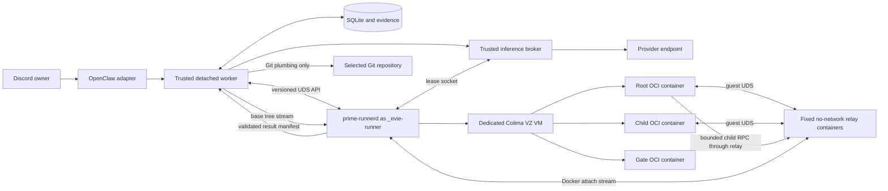

# Contained Execution Backend Implementation Plan

This document expands
[Workstream 2](./remediation-plan.md#workstream-2-implement-a-contained-execution-backend)
into a concrete implementation design. Its purpose is to close PD-01 without
weakening Prime Dispatch's existing confirmation, inference, child lifecycle,
recovery, evidence, and cleanup guarantees.

The supporting
[grounding and validation record](./contained-execution-backend-grounding.md)
separates repository facts, upstream-documented tool capabilities, observed
review-host facts, unresolved deployment assumptions, and hypotheses that must
be proved by a spike. The architecture below is a proposal until those gates
pass.

## Deployment decision

The target is Evie Platform's dedicated Apple-silicon Mac Mini running macOS
Tahoe. Implement v1 with:

- **a dedicated Colima profile named `prime-sandbox`**, using Apple's
  Virtualization.framework (`vmType: vz`) and the Docker runtime inside its
  Linux VM;
- **a new `_evie-runner` macOS service account**, separate from OpenClaw's
  `_evie-agent`, with no SSH key, provider credential, repository checkout,
  OpenClaw state, login shell, admin group, or sudo grant;
- **root-owned LaunchDaemons** for the Colima profile and `prime-runnerd`, both
  dropping to `_evie-runner` through `UserName`;
- **no macOS host mounts in the Colima VM** (`--mount=none`) and guest-native
  Docker volumes for source, result, and
  lease-socket state;
- **one container for the root Prime session and one container per child or
  verification gate**, each receiving only its own Docker volumes;
- **`--network=none` for every untrusted and relay container**. Inference and
  child-control bytes cross the VM through an attached, fixed relay process,
  not a host bind mount or a network route;
- **an immutable OCI image selected by digest**, built from a `Containerfile`,
  scanned, given an SBOM, signed, and preloaded into the dedicated VM;
- **Node HTTP over a macOS Unix socket plus strict Zod schemas** for the narrow
  runner API. Only `prime-runnerd` receives `DOCKER_HOST`; `_evie-agent` never
  receives a Docker/Colima socket or arbitrary container arguments;
- **Git plumbing plus a content-addressed result manifest** for final
  integration, avoiding repository hooks, filters, credential helpers, and
  shell execution in the trusted control plane.

This choice is grounded in Evie Platform's current architecture: ADR-0043
removed infrastructure services from Colima and explicitly reserved its future
use for agent sandboxing. The current Ansible tree no longer installs Colima or
Docker, so Workstream 2 must add a purpose-built sandbox role rather than revive
the old general-purpose profile.

The runtime remains a proposal until it passes the executable spike on real
Apple-silicon hardware. The backend must fail closed if the dedicated profile,
VM boot identity, image, policy, network denial, host-mount denial, or Docker
socket ownership is wrong. It must never fall back to `unsafe-local`.

## Why these tools

| Tool or approach                  | Decision       | Reason                                                                                                       |
| --------------------------------- | -------------- | ------------------------------------------------------------------------------------------------------------ |
| Dedicated Colima + Docker         | Use for v1     | Already evaluated operationally by Evie; VZ provides a Linux VM boundary and Docker provides `network=none`. |
| launchd LaunchDaemons             | Use            | Matches Evie's headless boot and service supervision pattern.                                                |
| Separate `_evie-runner` account   | Use            | Keeps VM/container authority out of the prompt-reachable `_evie-agent` account.                              |
| Node HTTP over Unix sockets + Zod | Use            | Matches the stack, streams large bodies, versions cleanly, and avoids a new RPC toolchain.                   |
| `Containerfile`                   | Use            | Reproducible OCI build consumed by Docker without coupling job requests to build tooling.                    |
| Syft + Grype                      | Use in release | Generate an SBOM and fail builds on reviewed vulnerability policy.                                           |
| Cosign                            | Use in release | Sign the image digest and attach SBOM/provenance attestations.                                               |
| Apple `container`                 | Revisit later  | Strong per-container VM boundary, but broker-only networking and stable recovery APIs are not yet proved.    |
| Podman machine                    | Do not use v1  | Duplicates the Linux-VM layer without matching Evie's prior operational work or accepted sandbox direction.  |
| Kubernetes                        | Do not use     | Adds a cluster control plane to a single-host, globally serialized detached-job problem.                     |

If the threat model later includes mutually hostile tenants or routinely
hostile kernel-exploit research, move the same runner protocol to Apple
`container` after its contract is proved, or to a separate physical runner.
The worker-facing protocol must not expose Docker- or Colima-specific details.

## Security boundary and process ownership

Separate the system into three trust levels:

1. **OpenClaw adapter and trusted control worker**
   - Owns authorization, confirmation, host policy, provider authentication,
     inference accounting, the SQLite authority, and durable evidence.
   - Can call the narrow runner API.
   - Never executes repository code, Prime SDK code, gates, dependency scripts,
     or Git hooks.
2. **`prime-runnerd` service**
   - Runs as the credential-free `_evie-runner` account.
   - Owns only the dedicated Colima profile and its Docker socket.
   - Converts a host-owned policy into fixed OCI operations.
   - Accepts opaque IDs and streamed content, never caller-selected host paths,
     images, mounts, Docker flags, or arbitrary host commands.
3. **Untrusted OCI containers**
   - Run Prime, IPython, children, gates, package lifecycle scripts, and
     repository-local Git operations.
   - Receive no provider credential and no route to the internet or host.
   - Can reach only their workspace and a scoped broker or child-control socket.



`_evie-runner` and `_evie-agent` share only a narrowly scoped
`_evie-prime-control` group for the runner control socket. `_evie-runner` must
not join the agent group, and `_evie-agent` must not be able to traverse the
runner home, read its Docker socket, invoke Colima as that user, or modify the
runner binary, LaunchDaemon plists, policy, image store, or VM state.

The current global one-job lease reduces cross-job exposure in the first
release. Still give root, child, and gate processes different mount/PID/IPC
namespaces and different workspace mounts. A child must not see the root or a
sibling child's workspace.

## Host prerequisites and layout

Require and audit:

- a supported macOS 26 release on Apple silicon with
  `kern.hv_support = 1`;
- exact pinned Colima, Lima, Docker CLI, and guest Docker Engine versions;
- the `vz` VM backend, `mounts: null` as resolved from `--mount none`, SSH-agent
  forwarding disabled, no reachable VM address, and no Kubernetes;
- a dedicated `_evie-runner` UID/GID and 0700 home, separate from
  `_evie-agent` and the administrative operator;
- root-owned LaunchDaemon plists, policy, executable, image trust material, and
  the canonical Colima configuration template;
- enough disk and fixed VM-level CPU/memory/disk ceilings for the image,
  guest-native volumes, and bounded jobs.

Recommended layout:

```text
/opt/evie/bin/prime-runnerd                     root:wheel 0755
/opt/evie/etc/prime-runner/policy.json          root:wheel 0644
/opt/evie/etc/prime-runner/colima.yaml          root:wheel 0644
/opt/evie/etc/prime-runner/seccomp.json         root:wheel 0644
/Library/LaunchDaemons/com.evie.prime-colima.plist  root:wheel 0644
/Library/LaunchDaemons/com.evie.prime-runner.plist  root:wheel 0644
/var/lib/evie-runner/                           _evie-runner:_evie-runner 0700
  .colima/prime-sandbox/                        dedicated VM and Docker socket
  state/                                        opaque runtime metadata only
/opt/evie/run/prime-runner/                     _evie-runner:_evie-prime-control 0750
  control.sock                                  _evie-runner:_evie-prime-control 0660
```

The OpenClaw installation command must not silently create system users or
install system services. Add a separate operator-reviewed runner installation
flow that requires administrative authority, then make the existing lifecycle
audit verify the installed runner without mutating it.

### launchd service shape

Add two Ansible-managed LaunchDaemons following Evie's existing system-domain
pattern:

1. `com.evie.prime-colima` runs Colima as `_evie-runner`, with explicit
   `HOME=/var/lib/evie-runner`, `COLIMA_PROFILE=prime-sandbox`, pinned PATH, and
   no agent/OpenClaw environment. Its wrapper verifies the root-owned expected
   configuration digest before starting the fixed profile in the foreground.
2. `com.evie.prime-runner` runs `prime-runnerd` as `_evie-runner`. Its wrapper
   waits for the exact profile socket, verifies its owner/mode and VM identity,
   then exports `DOCKER_HOST` only to runnerd.

Both use `RunAtLoad`, unconditional `KeepAlive`, `ThrottleInterval=30`, bounded
logs under `/opt/evie/log/prime-runner/`, and root-owned plist/wrapper files.
Intentional shutdown uses `launchctl bootout`; do not create a competing
LaunchAgent.

launchd does not create Unix sockets for the process. Runnerd must create the
control socket atomically beneath the pre-created 0750 runtime directory, set
mode 0660/group `_evie-prime-control`, reject a pre-existing non-socket or
wrong-owner path, and unlink it on clean shutdown. Record the plist, wrapper,
policy, Colima config, and runner binary digests in installation audit evidence.

## Runner API

### Transport

Use `node:http` over `/opt/evie/run/prime-runner/control.sock`:

- runnerd creates the socket beneath the Ansible-created runtime directory;
- the socket ACL is local service admission, not proof of Discord owner
  identity; bind each operation to the short-lived control-plane capability
  described in Workstream 1 when that capability is implemented;
- every route and body has a versioned strict Zod schema;
- JSON bodies have a small fixed limit;
- source trees, result blobs, and logs use streamed request/response bodies
  with `Content-Length`, SHA-256, byte ceilings, and backpressure;
- the server rejects transfer ambiguity, duplicate headers, unexpected content
  types, unknown fields, and unsupported protocol versions;
- request IDs, workspace IDs, and container IDs are generated by runnerd;
- the client never supplies a filesystem path, image tag, entrypoint, mount,
  environment variable name, or raw Docker/Colima argument.

Node does not expose macOS local-socket peer credentials through a stable public
API. Do not use private `socket._handle` methods. If exact peer UID/GID
enforcement is required beyond filesystem ownership, put a minimal root-owned
Rust acceptor in front of the TypeScript server and verify macOS
`LOCAL_PEERCRED`. Peer credentials still identify an OS process, not a Discord
owner, so they do not replace the per-operation control-plane capability.

Do not expose the Colima SSH configuration, Docker socket, or Docker context to
OpenClaw, and do not expose runnerd over TCP.

### Minimal API surface

Implement these operations:

```text
POST   /v1/workspaces
PUT    /v1/workspaces/:workspaceId/source
POST   /v1/workspaces/:workspaceId/seal
POST   /v1/runtimes
GET    /v1/runtimes/:runtimeId
POST   /v1/runtimes/:runtimeId/signal
GET    /v1/runtimes/:runtimeId/events
GET    /v1/workspaces/:workspaceId/result-manifest
GET    /v1/workspaces/:workspaceId/blobs/:sha256
DELETE /v1/runtimes/:runtimeId
DELETE /v1/workspaces/:workspaceId
GET    /v1/health
```

Semantics:

- `POST /workspaces` accepts only job ID, attempt ID, role, immutable original
  base SHA/tree SHA, expected source size/digest, and host-derived budgets.
- `PUT /source` streams one canonical source artifact and verifies its digest
  before publication.
- `seal` validates the source manifest, initializes the private Git repository,
  and makes source identity immutable.
- `POST /runtimes` accepts an enum such as `prime-root`, `prime-child`, or
  `verification-gate`; runnerd maps that enum to a fixed image entrypoint.
- `signal` accepts only `steer`, `abort`, `term`, or `kill` with the operations
  allowed for that runtime role.
- `events` is bounded NDJSON with monotonically increasing sequence numbers and
  reconnect from `Last-Event-ID`.
- result endpoints become available only after the complete runtime cgroup is
  empty and the workspace is sealed against further writes.
- delete operations are idempotent and return teardown evidence, including
  container identity, cgroup state, mount state, and deletion timestamps.

### Policy object

The trusted worker selects a host-owned policy ID. Runnerd loads the actual
policy from root-owned configuration. The request cannot provide weaker
values.

```ts
type ContainmentPolicyV1 = {
  id: "prime-macos-colima-v1";
  vmProfile: "prime-sandbox";
  vmType: "vz";
  hostMounts: "none";
  imageDigest: `sha256:${string}`;
  runtime: "docker";
  network: "none";
  readOnlyRootfs: true;
  capabilities: [];
  noNewPrivileges: true;
  seccompDigest: `sha256:${string}`;
  maxMemoryBytes: number;
  maxCpuQuota: number;
  maxPids: number;
  maxWorkspaceBytes: number;
  maxOutputBytes: number;
  maxRuntimeMs: number;
};
```

Runnerd returns the fully resolved policy plus image ID/digest. Store its
canonical digest in the preview, confirmation hash, job request, attempt,
checkpoint, result, and audit event. Resume fails if it changes.

## Source projection

Do not bind-mount the selected repository or its `.git` directory into a
container. Do not use `git clone` against a host path from inside the runner.

Build an exact, canonical source artifact from the confirmed base tree:

1. Revalidate the canonical repository path, repository root, object format,
   base commit, and base tree immediately before export.
2. Enumerate entries with Git plumbing (`ls-tree -r -z`) and read blobs with
   `cat-file --batch`; do not follow worktree symlinks.
3. Emit a canonical manifest containing relative path bytes, Git mode, object
   ID, SHA-256, size, and archive offset.
4. Permit regular files, executable files, directories, and Git symlinks.
   Reject devices, FIFOs, sockets, hard links, sparse entries, unknown modes,
   submodules and non-UTF-8 paths in v1, paths under a reserved
   `.prime-dispatch/` namespace, absolute paths, `..`, NULs, duplicates, and
   case-fold collisions on the target filesystem.
5. Stream the artifact directly to runnerd with a total byte ceiling and
   digest. Do not create a shared exchange directory or a macOS bind mount.
6. Runnerd creates a randomly named, labeled Docker volume and a fixed
   no-network materializer container. It streams the artifact over the Docker
   attach/exec channel. The audited materializer performs beneath-root path
   resolution, `O_EXCL` writes, digest verification, fsync, and atomic
   publication entirely inside the Linux VM.
7. The materializer initializes a private Git repository in that volume and
   creates a synthetic base commit. Persist the mapping between original base
   commit, original base tree, synthetic base commit, volume ID, and VM boot
   identity.

Using a tree artifact instead of a Git bundle avoids copying unrelated history,
remotes, hooks, repository config, alternates, replace refs, and credential
settings into the runner. All child branches and commits are private runner
objects; the original repository sees only the validated final tree delta.

Dirty source-checkout content remains excluded, matching current behavior.
Git LFS pointers remain inert pointer files because the container has no
network access.

## Container image

Add a root-owned, digest-pinned image containing only:

- Node.js 24 and the verified Prime-compatible runtime requirements;
- Python and IPython versions pinned through a hash-locked build input;
- Git and the minimum shell/runtime utilities required by supported gates;
- the `container-entry` program and broker/child socket bridges;
- CA certificates only if the build or tooling requires them; runtime egress is
  still disabled;
- a non-root `prime` user and an empty writable home supplied at runtime.

Do not include SSH clients, cloud CLIs, Docker clients, init systems, compilers
not required by supported repositories, or package-registry credentials.

Build requirements:

- pin the base image by digest;
- pin OS package sources to a reproducible snapshot where practical;
- lock Python wheels with hashes and use `--require-hashes`;
- keep the existing Prime runtime artifact content verification; either copy
  the artifact into the image at release time or mount the verified artifact
  read-only by digest;
- generate an SBOM with Syft;
- scan the final image and SBOM with Grype using a documented severity and
  exception policy;
- sign the image digest and attach SBOM/provenance attestations with Cosign;
- make the runner installer verify the signature and expected identity before
  importing the image into the dedicated Colima profile;
- set `--pull=never` for every job. Network retrieval must never occur during
  admission or resume.

Automate digest updates through reviewable pull requests. Never accept an
image tag in host config or a job request.

## OCI runtime policy

Runnerd must construct the OCI request itself. The following is an illustrative
policy, not a caller-visible command template:

```text
docker create
  --pull=never
  --read-only
  --network=none
  --cap-drop=all
  --security-opt=no-new-privileges
  --security-opt=seccomp=<verified-guest-profile>
  --pids-limit=<host-policy>
  --memory=<host-policy>
  --cpus=<host-policy>
  --ulimit=nofile=<host-policy>
  --stop-timeout=<host-policy>
  --tmpfs=/tmp:rw,nosuid,nodev,noexec,size=<host-policy>
  --tmpfs=/run:rw,nosuid,nodev,noexec,size=<host-policy>
  --mount=type=volume,src=<runner-generated-workspace-volume>,dst=/workspace,rw
  --mount=type=volume,src=<runner-generated-lease-volume>,dst=/run/prime,rw
  --user=<fixed-non-root-uid>:<fixed-non-root-gid>
  --workdir=/workspace
  --label=<runner-generated-job-identity>
  <verified-image-digest>
  <fixed-role-entrypoint>
```

Required invariants:

- no `--privileged`, host namespace, host network, device, arbitrary volume,
  container-engine socket, SSH agent, inherited file descriptor, or host
  environment import;
- private PID, IPC, mount, UTS, and network namespaces;
- a read-only root filesystem with bounded tmpfs mounts;
- only one workspace and the exact role-specific sockets mounted;
- Docker/cgroup limits for CPU, memory, PIDs, and file descriptors, plus a
  host-owned wall-clock timer and a fixed VM-level resource ceiling;
- image and entrypoint selected from root-owned policy;
- container and volume labels include job, attempt, role, workspace, policy
  digest, image digest, profile, and VM boot identity so reconciliation can
  reject substitutions.

Start with Docker's default seccomp profile plus explicit no-new-privileges and
zero capabilities. Record syscalls from the deterministic and live fixture
suites, then publish a tighter project profile. Do not guess a tiny syscall
allowlist that breaks Node, Python, or Git and tempts operators to use
`seccomp=unconfined`.

The VZ Linux VM is the macOS host boundary; Docker namespaces and cgroups are
the within-VM job boundary. Verify the Colima profile has no macOS mounts and
that the job has no Docker socket. Before permitting concurrent unrelated jobs,
prove that distinct Docker volumes and container UIDs prevent cross-workspace
access after a container escape inside the VM, or allocate one VM per job.

## Inference path with no container network

The existing broker should remain in the trusted worker because it holds the
provider access token and authoritative usage callbacks.

Add a VM-crossing relay that does not require host mounts or VM networking:

1. The trusted worker creates one macOS Unix socket per inference lease beneath
   its private runtime directory. The path is derived from a validated opaque
   lease ID rather than accepted as a caller-selected path.
2. Runnerd connects to that socket after a capability-bound request. The broker
   retains the provider credential and binds the connection to the lease,
   expiry, model, budget, and revocation state.
3. Runnerd creates a guest-native Docker volume and a fixed `broker-relay`
   container with `--network=none`. The relay listens on
   `/relay/broker.sock` in that volume and exposes only a framed bidirectional
   byte stream on its attached stdin/stdout.
4. Runnerd bridges the relay's Docker attach stream to the trusted broker
   socket. The relay image and command are fixed by policy; it accepts no
   destination, hostname, port, path, or proxy command from the job.
5. Runnerd mounts the same guest volume into only the matching root or child at
   `/run/prime`. A small fixed bridge inside the job image listens on container
   loopback and forwards HTTP bytes to `/run/prime/broker.sock`. Prime continues
   to use `http://127.0.0.1:<fixed-port>/v1`.
6. The job still presents the scoped bearer token. The broker enforces lease
   ID, token digest, job/child binding, model, reasoning, concurrency, request
   bytes, request count, token budget, expiry, redirect rejection, SSE bounds,
   and revocation exactly as it does now.

The bridge has no destination parameter, DNS resolver, CONNECT support,
generic proxy behavior, or filesystem browsing. It knows one socket and one
framed attach stream. If the volume, attach stream, or bridge fails, the job
fails; runnerd must not enable container networking, publish a host port, or
mount a host path as a fallback.

Test from inside the container that internet, DNS, host loopback, RFC 1918,
link-local, IPv6, cloud metadata, and arbitrary Unix sockets are unreachable
while the scoped broker request succeeds.

## Root-agent execution

Move all Prime SDK loading and environment mutation out of `src/worker.ts` and
into `container-entry`:

1. The trusted worker prepares host policy, broker lease, source artifact, and
   runner workspace.
2. Runnerd starts a `prime-root` container with the root workspace volume and
   guest-native broker/child-control volumes backed by fixed attached relays.
3. `container-entry` constructs a strict environment from constants and
   host-approved values. It must not inherit runnerd's environment.
4. The entrypoint verifies the mounted runtime/image identity and workspace
   manifest, writes the private Prime model configuration, loads the SDK, and
   exposes only IPython plus the remote child host.
5. Agent JSONL/events stream through runnerd to the trusted worker with the
   existing byte limits and hashing behavior.
6. Steering and cancellation travel through the runner API to the entrypoint.
7. Completion is not trusted until runnerd proves the container has exited,
   no process remains in its cgroup, and the workspace volume is sealed.

The container environment allowlist should contain only locale, minimal PATH,
job-private HOME/TMPDIR, fixed runtime paths, job/attempt IDs, the local broker
URL, scoped broker token, fixed provider/model/reasoning, and bounded child
policy. Tests should seed the runnerd environment with fake OpenClaw, AWS, GCP,
Azure, SSH, GitHub, package-registry, CI, proxy, and database secrets and prove
none appears in the container.

## Child execution

Preserve durable child admission in the trusted worker, but replace in-process
child sessions with a remote runtime:

- `container-entry` in the root implements Prime's `subagentRuntimeHost` with a
  `RemoteRlmHostProxy` over a guest-native child-control Unix socket. A fixed
  no-network relay carries its framed stream over Docker attach to runnerd and
  the trusted worker.
- The trusted worker exposes only bounded `run`, `inspect`, and `cancel`
  operations on that socket. It reuses `BoundedRlmHostBridge` for prompt,
  model, reasoning, dependency, concurrency, retry, and lifecycle admission.
- Replace `GatedPrimeSubagentHost`'s in-process `PrimeSession` implementation
  with a `ContainedNativeRlmRuntime` that asks runnerd to create a child
  workspace and `prime-child` container.
- The child workspace is projected from the admitted root wave base, not
  bind-mounted from the root workspace.
- The child receives only its worktree, child-specific inference lease, private
  HOME/TMPDIR, and event channel. It does not receive the root child-control
  socket.
- On success, runnerd exports a bounded proposal manifest and blobs. The
  trusted child coordinator verifies base identity and digest, then asks
  runnerd to integrate the proposal into the root workspace. Integration Git
  commands run under the credential-free runner account with hooks, filters,
  remotes, helpers, pagers, and editors disabled.
- Pause the root container with Docker while runnerd snapshots a wave base or
  integrates a child proposal. Revalidate root HEAD and worktree state before
  and after the operation, then unpause it. This prevents a daemonized root
  tool from racing the trusted child integration while the SDK awaits the
  child result.
- The root sees the new wave base only after durable integration evidence is
  committed, matching current ordering.
- Cancellation destroys only the selected child container/volumes and revokes
  only its lease. Root cancellation recursively destroys all child and gate
  runtimes.

The root and child containers must never share a writable mount. This preserves
the current proposal/integration model as an actual isolation property rather
than a directory convention.

## Verification gates and dependencies

Run each gate in a fresh `verification-gate` container against the root
workspace after Prime and all children are quiescent. The gate command and argv
come only from the confirmed host policy, but execute inside containment because
repository code and dependency scripts remain hostile.

Each gate gets:

- the root workspace and a new private HOME/TMPDIR;
- no broker socket and no child-control socket;
- no network;
- its own PID/cgroup limits and timeout;
- bounded stdout/stderr returned through runnerd;
- no inherited environment or credentials.

Dependency handling must not reintroduce general egress. Recommended flow for
pnpm repositories:

1. In a separate credential-free dependency-build container, fetch only from a
   host-approved registry proxy using the confirmed lockfile.
2. Use `pnpm fetch --frozen-lockfile --ignore-scripts` to populate a
   content-addressed store.
3. Record the lockfile digest, registry identity, package integrity records,
   store artifact digest, and scanner result.
4. Mount the verified store read-only into the job container and run
   `pnpm install --offline --frozen-lockfile`; lifecycle scripts execute only
   inside containment.
5. Never mount the operator's normal pnpm/npm cache or `.npmrc`.

For the first milestone, support only repositories whose dependency artifact
is prepared ahead of the job. Treat on-demand registry access as a later,
separately reviewed feature. If added, route it through an allowlisting package
proxy with no internal-network reachability, not normal container egress.

## Result export and trusted Git integration

Do not copy a runner-created `.git` directory or import arbitrary refs directly
into the selected repository. Export a narrow content-addressed tree delta:

```ts
type ContainedResultManifestV1 = {
  schemaVersion: 1;
  jobId: string;
  attemptId: string;
  originalBaseSha: string;
  originalBaseTreeSha: string;
  syntheticBaseSha: string;
  runnerHeadSha: string;
  runnerTreeSha: string;
  policyDigest: string;
  imageDigest: string;
  entries: Array<{
    path: string;
    operation: "add" | "modify" | "delete";
    mode?: "100644" | "100755" | "120000";
    size?: number;
    sha256?: string;
  }>;
  totalBytes: number;
};
```

Integration sequence:

1. Stop every root, child, relay, and gate runtime and seal the guest-native
   workspace volume. Start a fixed, no-network exporter with that volume mounted
   read-only and stream its manifest/blobs to runnerd over Docker attach. Never
   bind-mount the volume into macOS.
2. Revalidate manifest ownership, policy/image identity, base commit/tree,
   path rules, modes, counts, per-file size, total size, and blob digest.
3. Re-read the selected repository and prove that the confirmed base commit and
   target branch have not changed.
4. Use a temporary Git index seeded with the base tree. For each changed blob,
   call `git hash-object -w --stdin` with literal argv and update only the
   corresponding cache entry. Do not pass a path to `hash-object`, which avoids
   clean filters.
5. Use `git update-index --cacheinfo`, `git write-tree`, and `git commit-tree`
   with fixed attribution and parent. These plumbing commands do not run hooks.
6. Compare the constructed tree to an independently reconstructed result tree
   from the manifest.
7. Atomically create/update only the owned `refs/heads/prime/<job-id>` ref with
   the expected old value.
8. Materialize the owned result worktree with a secure file writer that never
   follows symlinks and refuses path changes after validation. Do not use a Git
   checkout if repository config can enable external filters.
9. Record the host commit SHA, manifest digest, per-blob digests, and runner
   identities in the terminal transaction.

Run Git with `GIT_CONFIG_NOSYSTEM=1`, `GIT_CONFIG_GLOBAL=/dev/null`, disabled
credentials/remotes, no pager/editor/signing, and an empty root-owned
`core.hooksPath`. Extend repository admission to reject local `include` and
`includeIf` directives, alternates, replace refs, external object directories,
`core.fsmonitor`, `core.sshCommand`, external diff/text conversion, every
`filter.*` driver, and other configuration that would execute programs during
trusted-side operations.

Initially reject symlink changes if the secure materializer cannot provide
race-free beneath-root operations. The trusted materializer runs on macOS, so
do not specify Linux `openat2()` for this path. Use a small audited Rust or Swift
helper that walks from an already-open root directory descriptor with Darwin
`openat()`/`fstatat()`, `O_NOFOLLOW`, `AT_SYMLINK_NOFOLLOW`, and atomic
`renameat()` operations. Revalidate every opened component and never resolve a
caller-controlled absolute path.

This approach preserves an automatic local commit without executing runner
code or repository hooks as the OpenClaw user. Child commit SHAs remain runner
evidence; the trusted repository receives one attributable final commit. If
preserving the exact child commit graph is a product requirement, design and
review a separate strict pack-import protocol later.

## Cancellation, reconnect, resume, and cleanup

Extend durable identity with:

- runner protocol version and runnerd boot identity;
- workspace ID and source-manifest digest;
- runtime IDs for root, children, and gates;
- Colima profile and VM boot identity, Docker container/volume IDs, OCI image
  digest, containment-policy digest, cgroup identity, role, and start timestamp;
- broker and child-control socket lease IDs, never their bearer values;
- last event sequence and sealed/result state.

Reconciliation must call runnerd and compare every field with `colima status`,
the profile configuration digest, `docker inspect`, and guest cgroup state. A
matching live runtime may reconnect. A missing/replaced VM, changed host-mount
policy, wrong image/policy/label, or ambiguous runtime becomes interrupted; do
not recreate it silently.

Cancellation order:

1. revoke the applicable inference lease;
2. send the structured Prime abort;
3. wait the confirmed grace period;
4. stop and then kill the Docker container;
5. verify the container is absent and its cgroup has no tasks;
6. if Docker or guest-state verification fails, force-stop the entire dedicated
   Colima VM and mark every runtime on that VM interrupted;
7. prove there are no tasks, containers, attached relays, or unexpected volumes
   left;
8. seal or quarantine the workspace and persist teardown evidence.

Runnerd performs cleanup by opaque workspace/runtime ID and generates all
paths beneath its fixed root. It must revalidate labels, ownership, canonical
location, mount state, cgroup state, and image identity immediately before
deletion. The trusted control cleanup plan records the exact runner objects and
requires a new runner snapshot if any identity changes.

On service startup, runnerd verifies the profile and VM boot identity, then
inventories labeled containers and volumes. Unknown, corrupt,
running-without-authority, or mismatched objects are quarantined or stopped,
never adopted based on a path or name alone. A profile with any macOS mount or
an unexpected Docker context is rejected wholesale.

## Data model and migration

Add explicit schemas rather than overloading the current host worktree fields:

- `execution_backends`: backend kind, policy ID/digest, image digest, runner
  protocol, and resolved platform capabilities;
- `runner_workspaces`: opaque ID, role, original base identity, source digest,
  synthetic base, lifecycle state, and seal/result digests;
- `runner_runtimes`: opaque ID, container/cgroup identity, role, image/policy
  digest, event cursor, and teardown evidence;
- child worktree identity v2: runner workspace ID instead of a host path;
- checkpoints for source export/upload/seal, runtime create/start/quiesce,
  result export/verify, trusted tree construction, ref update, and materialize;
- terminal result fields for containment policy, image, runner, source, result,
  and teardown evidence.

Keep old unsafe-local jobs readable. Migration must not reinterpret their host
worktree paths as contained workspaces. Resume is allowed only through the same
backend and policy identity recorded by the original attempt.

## Code changes

### New modules

- `src/runner-protocol.ts`: strict request/response/event schemas.
- `src/runner-client.ts`: UDS HTTP client, streaming, digest, retry, and peer
  failure handling.
- `src/contained-execution.ts`: `ContainedExecutionBackend` orchestration.
- `src/contained-source.ts`: canonical Git tree export and manifest.
- `src/contained-result.ts`: result verification and trusted Git plumbing.
- `src/contained-broker.ts`: per-lease Unix-socket listener lifecycle.
- `src/contained-child-runtime.ts`: trusted `NativeRlmRuntime` backed by
  runnerd.
- `src/runner/daemon.ts`: credential-free runner service.
- `src/runner/policy.ts`: root-owned policy loading and invariant checks.
- `src/runner/colima.ts`: profile/config/VM identity preflight and fail-closed
  VM shutdown.
- `src/runner/docker.ts`: literal Docker invocation, context confinement, and
  container/volume inspect validation.
- `src/runner/workspace.ts`: source extraction, private Git, sealing, result
  export, quotas, and deletion.
- `src/runner/relay.ts`: fixed framed Docker-attach relay for broker and child
  control traffic.
- `src/runner/materializer.ts`: fixed guest helper for source import and result
  export over Docker attach.
- `src/runner/container-entry.ts`: fixed root/child/gate entrypoints.
- `src/runner/remote-rlm-host.ts`: root-container child RPC proxy.

### Existing modules

- Expand `src/execution.ts` from worktree preparation to the full runner
  lifecycle and add a backend discriminator.
- Refactor `src/worker.ts` so Prime, children, and gates are invoked only
  through `ExecutionBackend`; keep provider auth and SQLite outside it.
- Split `src/prime-sdk.ts` into container-side session code and trusted-side
  child admission. Remove `process.env` mutation from the trusted worker.
- Replace host paths in `src/child-git.ts` with workspace identities and
  runner-side proposal/integration calls.
- Preserve `src/child-host-bridge.ts` policy checks while swapping in the
  contained runtime.
- Add Unix-socket lease listeners to `src/inference.ts` without weakening the
  existing HTTP validation.
- Extend `src/schemas.ts`, `src/store.ts`, `src/sqlite.ts`, migrations, resume,
  cleanup, artifacts, and presentations with containment identity.
- Extend `src/openclaw-install.ts` audit to verify runner availability and
  policy, but keep privileged runner installation separate.
- Harden trusted Git operations in `src/process.ts` and repository admission.

Do not let `ContainedExecutionBackend` become a thin worktree creator followed
by the existing host-side `AgentBackend` and gate calls. The backend boundary
must encompass every repository-influenced executable operation.

### Evie Platform provisioning changes

Implement privileged host integration in `evie-platform`, not in an OpenClaw
plugin installation hook:

- add an Ansible `prime_runner` role that creates `_evie-runner` and
  `_evie-prime-control`, adds only `_evie-agent` to the control group, and
  creates the runner home/runtime/log directories with explicit modes;
- install pinned Colima and Docker CLI packages, but set no global
  `DOCKER_HOST`, Docker context, shell profile, or `/var/run/docker.sock` link;
- deploy the two root-owned LaunchDaemon plists/wrappers and canonical runner,
  Colima, seccomp, image-trust, and policy files;
- initialize the named `prime-sandbox` profile as `_evie-runner` with
  `--mount none`, VZ, Docker, no Kubernetes, no SSH-agent forwarding, no
  auto-activation, and no reachable VM address;
- preload the verified image by digest during provisioning/upgrade, before the
  gateway can select the policy;
- extend the verify role to assert account/group separation, socket denial from
  `_evie-agent`, resolved profile/guest mounts, exact VM/runtime/image identity,
  network-none behavior, and absence of legacy/default Colima profiles;
- expose operator-only `evie agent prime-runner status|stop|start|reset`
  commands through tightly matched sudoers entries. Do not grant `_evie-agent`
  service-management, Colima, Docker, SSH, or arbitrary `_evie-runner` sudo;
- add an upgrade hold-down: stop Prime admission, drain/cancel jobs, stop
  runnerd/profile, update and verify artifacts, then re-enable only after the
  malicious canary passes.

The Prime Dispatch repository owns the protocol, runner implementation, image,
and deterministic tests. Evie Platform owns macOS identities, packages,
LaunchDaemons, configuration, installation audit, and physical-host acceptance.

## Implementation milestones

### Milestone 2A: ADR and executable spike

Deliver:

- an ADR freezing the trust boundary and tool choice;
- Evie Platform ADR/addendum freezing the macOS, account, LaunchDaemon, Colima,
  socket, and no-host-mount decisions;
- Colima profile/config/VM and Docker preflight/inspect code;
- a minimal runnerd UDS API;
- one malicious fixture container proving read-only rootfs, workspace-only
  writes, no network, attach-relayed broker-only UDS access, container/VM kill,
  and no surviving process;
- proof that `_evie-agent` cannot read the runner home or Docker socket and the
  VM contains no macOS mounts;
- a documented fail-closed path when Colima is absent or its identity drifts.

Exit criterion: the spike proves the security contract on the target host. Do
not merge a spike that uses host networking or broad mounts.

### Milestone 2B: Runner protocol and workspace projection

Deliver:

- versioned schemas, peer checks, streaming limits, and policy resolution;
- canonical base-tree export/import;
- workspace quota, private Git initialization, sealing, and deletion;
- fake runner client for deterministic tests;
- crash injection at create/upload/seal boundaries.

Exit criterion: a malicious source tree cannot escape or alter runner-owned
metadata, and no caller-controlled macOS path reaches Colima or Docker.

### Milestone 2C: Single-root Prime path

Deliver:

- root container entrypoint;
- verified runtime/image selection;
- strict environment allowlist;
- UDS inference path;
- streaming events, steer, cancellation, quiescence, and result export;
- unsafe-local production kill switch.

Exit criterion: the existing live single-root fixture completes with network
disabled and fails every host credential/egress probe.

### Milestone 2D: Children and gates

Deliver:

- remote RLM host proxy;
- separate child workspaces/containers and per-child broker sockets;
- proposal integration and wave-base evidence;
- separate no-network gate containers;
- recursive cancellation and reconnect identity.

Exit criterion: deterministic and live multi-child behavior is preserved, and
root/child/sibling mount probes fail.

### Milestone 2E: Trusted integration, recovery, and lifecycle

Deliver:

- result manifests and content-addressed blobs;
- Git plumbing integration and secure materialization;
- migrations, resume, cleanup, orphan reconciliation, and fault injection;
- runner installer, audit, signed-image verification, SBOM, scanner policy,
  and operator docs.

Exit criterion: forced crashes at every checkpoint either roll back or preserve
unambiguous evidence, with no duplicate Prime call, gate, ref update, or result
commit.

### Milestone 2F: Adversarial acceptance and independent review

Deliver:

- disposable-host malicious fixture suite;
- resource-exhaustion, symlink/race, daemonization, Git execution, socket,
  network, metadata, and cross-workspace tests;
- measured teardown and quota evidence;
- independent security review and closure record for PD-01.

Exit criterion: every PD-01 closure criterion in the remediation plan is met.

## Test strategy

### Deterministic unit tests

- policy canonicalization and downgrade rejection;
- every runner API schema, unknown-field rejection, and size limit;
- Colima/Docker argv and configuration generation from host policy with no
  caller-controlled tokens;
- source/result manifest path, mode, digest, count, and collision validation;
- broker socket lease binding and revocation;
- child RPC binding and cross-job/child replay rejection;
- event ordering, truncation, reconnect cursor, and digest behavior;
- migration compatibility and unsafe-local/non-contained resume rejection.

### Integration tests with fake runtime adapters

- full worker state machine through a fake runner client;
- fault injection before and after each runner side effect;
- runtime substitution, image/policy drift, cgroup mismatch, stale event stream,
  partial upload, and corrupted result behavior;
- root, child, gate, cancel, resume, cleanup, and orphan reconciliation.

### Colima/VZ acceptance tests

Run on a disposable, credential-free Apple-silicon Mac with the production
launchd/account/profile topology. Tart CI cannot exercise this layer because
Evie Platform has already established that nested virtualization is
unavailable. The fixture must attempt:

- reads of OpenClaw, runner, control database, SSH, cloud, package, GitHub, and
  host environment data;
- writes outside the workspace and into another root/child/sibling workspace;
- internet, DNS, localhost, private network, IPv6, metadata, and arbitrary UDS
  connections;
- `/proc` host inspection, ptrace, mount, namespace, BPF, device, and
  container-socket access;
- fork bombs, memory/disk exhaustion, oversized logs, and daemonization;
- Git hooks, filters, helpers, pagers, editors, alternates, replace refs, and
  malicious result paths;
- broker token reuse across root/child/job/expiry/revocation boundaries;
- worker, runnerd, container, Colima VM, launchd service, and host restarts at
  every durable checkpoint;
- access to `_evie-agent` state from the VM, and Docker/Colima authority from
  `_evie-agent` on macOS.

The suite passes only if the scoped inference request succeeds, all forbidden
access fails, resource limits hold, cancellation empties the cgroup, and no
secret-shaped value appears in events or artifacts.

GitHub-hosted and Tart CI should run deterministic/fake-runtime tests only. Run
the VZ suite on a freshly provisioned physical Mac or a dedicated sacrificial
Evie host, erase the runner profile after each run, and provide it no production
credentials.

## Observability and audit evidence

Record without secrets:

- policy ID/digest, image digest, runner version/boot ID, workspace/runtime IDs,
  role, Colima profile/VM boot identity, container/volume IDs, cgroup path hash,
  and timestamps;
- source and result manifest digests and byte counts;
- broker lease ID/token digest, request/usage totals, and revocation reason;
- resource peaks, timeout/signal sequence, exit code, OOM indication, and
  teardown proof;
- every rejected runner operation and policy mismatch with bounded fields;
- installation audit results for macOS/hardware identity, service-account and
  socket modes, plist/config digests, image signature, VZ/profile/VM identity,
  absence of host mounts, Docker socket isolation, guest cgroups,
  network-none probe, and unsafe-local disablement.

Never log raw environment variables, broker tokens, provider credentials,
request/response bodies, source blobs, or arbitrary Docker/Colima inspect
output.

## Stop-ship conditions

Do not enable the contained backend for real Prime if any of these is true:

- the runner executable, LaunchDaemon plist/wrapper, policy, canonical Colima
  config, seccomp profile, or image-signing trust policy is writable by
  `_evie-agent` or `_evie-runner`;
- the job selects an image by tag, accepts a digest/signature mismatch, or can
  import an image during execution;
- `_evie-agent` can read or use the Colima/Docker socket, or Docker can pull an
  image at job time;
- the Colima profile exposes any macOS host mount, forwards the SSH agent, has a
  reachable VM address, auto-activates a Docker context for `_evie-agent`, or
  runs an unexpected workload;
- any untrusted container has normal network access;
- provider credentials enter runnerd or a container;
- the selected repository, `.git`, OpenClaw state, control state, host HOME, or
  container-engine socket is mounted;
- root and child share a writable workspace;
- gates or repository-influenced Git commands still execute in the trusted
  worker;
- cancellation cannot prove the container is absent and its guest cgroup is
  empty, or cannot force-stop the dedicated VM when Docker becomes unreliable;
- resume accepts a changed image, policy, source, workspace, runtime, or runner
  identity;
- final integration can invoke hooks, filters, helpers, pagers, editors, or a
  shell;
- a containment failure falls back to `unsafe-local`.

## Definition of done

The contained backend is production-ready when:

- the target Apple-silicon macOS host passes the Evie/launchd/account/Colima/VZ
  installation preflight and audit;
- image build, SBOM, scanning, signing, import, and digest verification are
  reproducible;
- every root, child, dependency script, and gate runs through runnerd under the
  fixed OCI policy;
- only job-scoped inference works from an untrusted container;
- source projection and result integration expose no host path or executable
  Git extension point;
- cancellation, reconnect, resume, cleanup, and crash recovery retain the
  current fail-closed semantics;
- deterministic, live single-root, live multi-child, and malicious fixture
  suites pass on a disposable host;
- no stop-ship condition remains; and
- a follow-up independent assessment confirms there is no reachable path from
  repository/model-controlled input to OpenClaw-user filesystem, process, or
  network authority.
